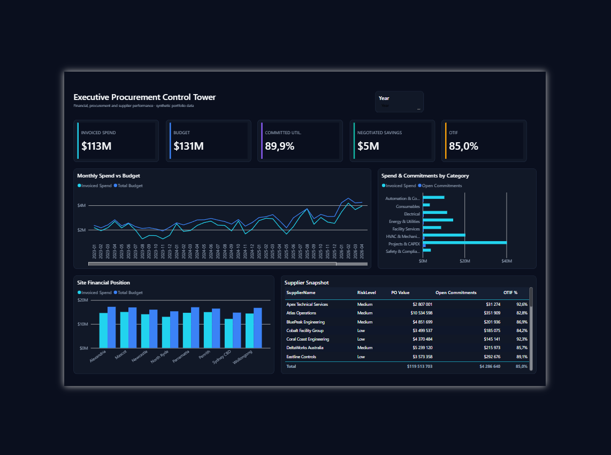
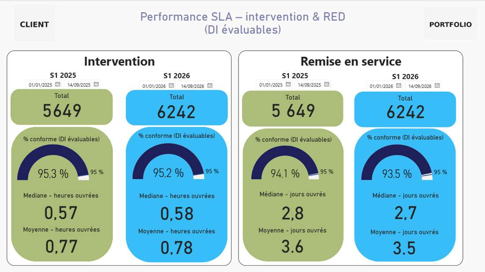

# Jefferson Mawapanga Saku — Power BI Portfolio

> **Financial steering · Procurement analytics · Supplier performance · SLA / penalties · Operational decision support**

[⚡ Power Platform portfolio](https://github.com/jeffersonkuku/jefferson-Mawapanga-Saku) · [▶ Power Apps demo](https://www.youtube.com/watch?v=Y15BCn_i-fo) · [🇫🇷 Français](#francais)

## 30-second portfolio

<table>
<tr>
<td width="33%" valign="top">

 <strong>Procurement & Financial Control Tower</strong> 
Budget, spend, commitments, savings, OTIF, supplier risk and late exposure.
  <a href="./powerbi-procurement-financial-control-tower/"><strong>Open project →</strong></a>
</td>

<td width="33%" valign="top">

 <strong>SLA & Penalties</strong> 
Service performance, backlog, P95, evaluable populations and contractual exposure.
  <a href="./powerbi-sla-penalties-portfolio/"><strong>Open project →</strong></a>
</td>

<td width="33%" valign="top">

 <strong>P2 Financial Monitoring</strong> 
Procurement, subcontracting, budget trajectories, commitments and invoicing.
  <a href="./powerbi-p2-consumables-financial-monitoring/"><strong>Open project →</strong></a>
</td>
</tr>
</table>

**Five end-to-end Power BI projects** · Power Query · DAX · semantic modelling · PBIP/PBIR/TMDL · business KPI design · dashboard UX

---

## What I can deliver with Power BI

| Business need | Capability |
|---|---|
| **Financial steering** | Budget, commitments, invoicing, variance and consumption tracking |
| **Procurement performance** | Purchase orders, suppliers, savings, OTIF and overdue exposure |
| **Maintenance / service performance** | SLA, backlog, intervention delays, P95 and penalties |
| **Data modelling** | Power Query, dimensional models, shared calendars and reusable measures |
| **Decision support** | Executive views, drill-through, exception analysis and operational detail |

## All projects

| Project | Business focus | Technical evidence |
|---|---|---|
| **[Procurement & Financial Control Tower](./powerbi-procurement-financial-control-tower/)** | Budget execution, spend, commitments, savings, OTIF, supplier risk | PBIP, PBIR, TMDL, DAX measures, shared dimensions |
| **[SLA & Penalties Operations](./powerbi-sla-penalties-portfolio/)** | SLA, backlog, P95, service performance, contractual exposure | KPI populations, SLA parameterisation, PBIP/TMDL |
| **[P2 Consumables Financial Monitoring](./powerbi-p2-consumables-financial-monitoring/)** | Procurement, subcontracting, annual budgets, invoicing | Shared calendar, cumulative DAX, reconciliation |
| **[Financial Pilotage](./powerbi-financial-pilotage-portfolio/)** | Budget execution, commitments, suppliers, PO traceability | Power Query, DAX, drill-through, financial KPIs |
| **[Procurement & Budget](./powerbi-procurement-budget-portfolio/)** | Purchasing activity, recurring orders, budget consumption | Power Query, DAX, period comparisons |

## From data to decision

These projects are structured around the complete analytical workflow:

**Data preparation → Semantic model → DAX / KPI logic → Business analysis → Dashboard UX → Decision support**

The portfolio focuses on business questions rather than decorative dashboards: what is over budget, what is late, where risk is concentrated, which supplier or service is underperforming, and what requires action.

## Professional context

The public projects are anonymised portfolio reconstructions inspired by reporting, analytics and operational-steering work carried out in professional environments.

Business logic and analytical methods are preserved while names, identifiers, values, source systems and confidential datasets are anonymised, modified or recreated.

## Power Platform

My work also covers **Power Apps, Power Automate and SharePoint** for end-to-end business applications and workflow automation.

**[⚡ Open the Power Platform portfolio](https://github.com/jeffersonkuku/jefferson-Mawapanga-Saku)** · **[▶ Watch the Power Apps demo](https://www.youtube.com/watch?v=Y15BCn_i-fo)**

---

# 🇫🇷 Français

## Vue rapide

Ce dépôt regroupe **cinq projets Power BI de bout en bout** autour du pilotage financier, des achats, de la performance fournisseurs, des SLA, du backlog et des pénalités.

Les trois projets à ouvrir en priorité :

**[Procurement & Financial Control Tower](./powerbi-procurement-financial-control-tower/)** ·
**[SLA & Penalties](./powerbi-sla-penalties-portfolio/)** ·
**[P2 Financial Monitoring](./powerbi-p2-consumables-financial-monitoring/)**

## Ce que je démontre

**Power BI Desktop · Power Query / M · DAX · Modélisation sémantique · PBIP · PBIR · TMDL · KPI financiers · Analyse achats · OTIF · SLA · P95 · Backlog · Drill-through · Contrôles de cohérence**

La logique est toujours la même :

**Préparation des données → Modélisation → DAX / KPI → Analyse métier → UX dashboard → Aide à la décision**

Les données publiques sont anonymisées ou synthétiques afin de démontrer les compétences sans exposer d'informations confidentielles.

**[⚡ Voir aussi mon portfolio Power Platform](https://github.com/jeffersonkuku/jefferson-Mawapanga-Saku)**
