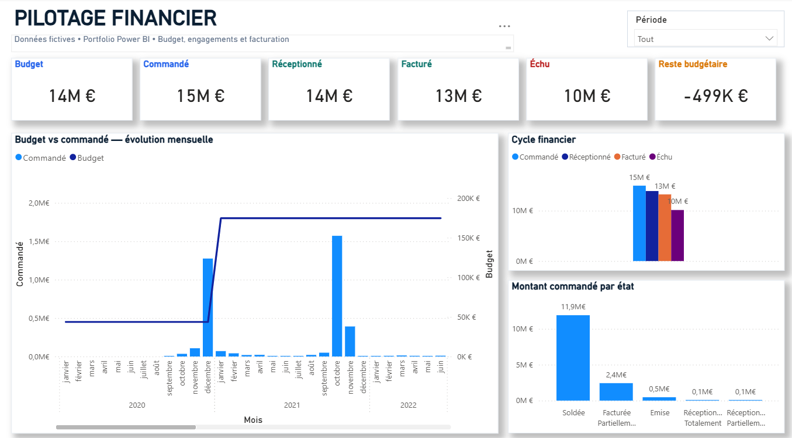
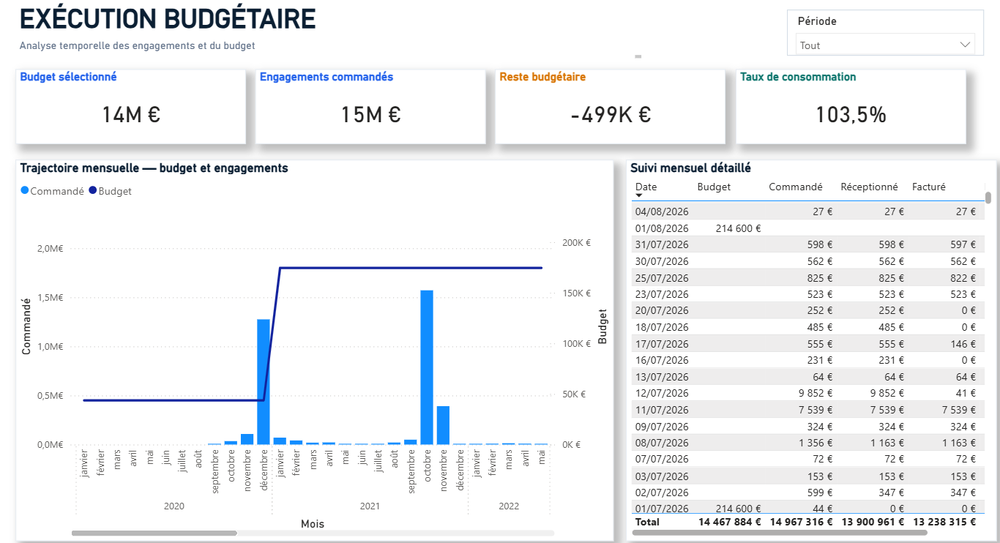
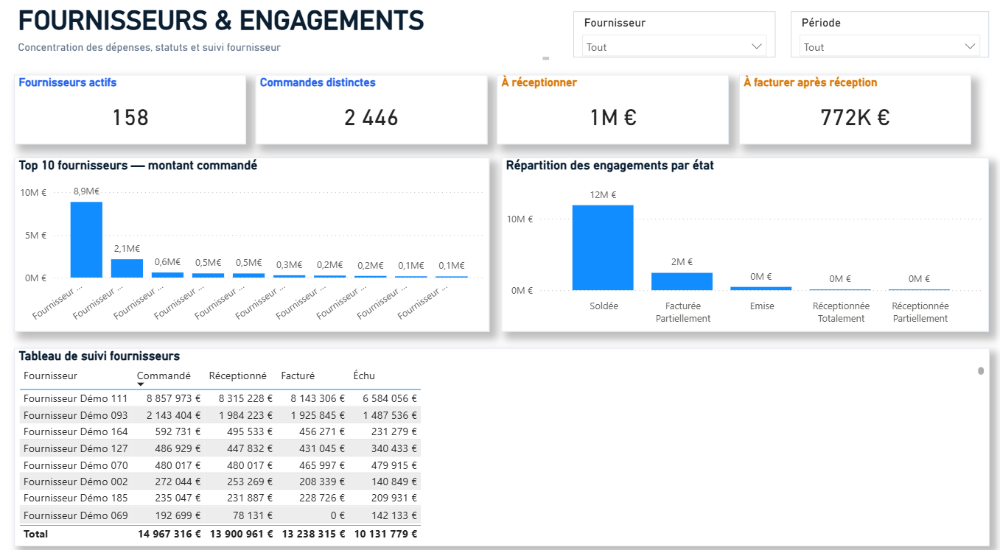
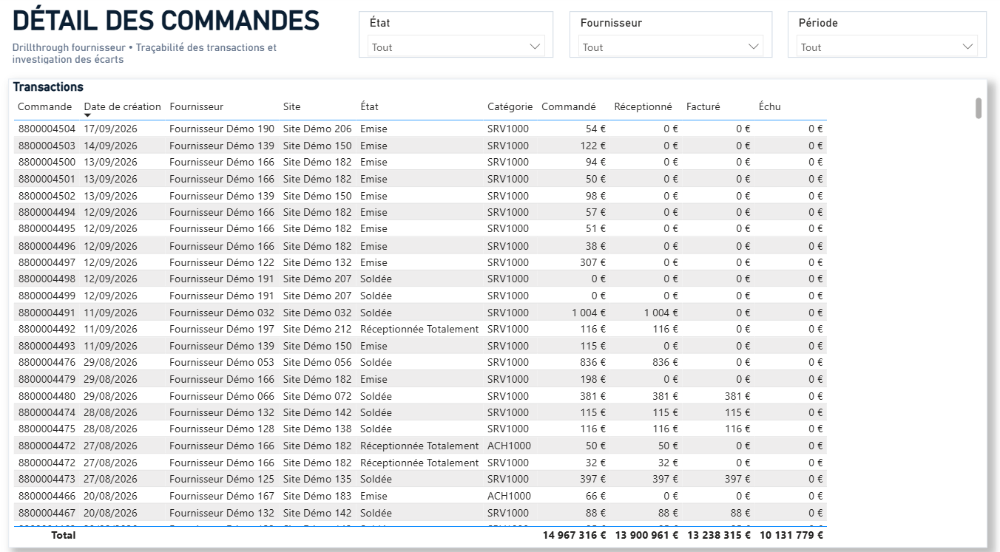
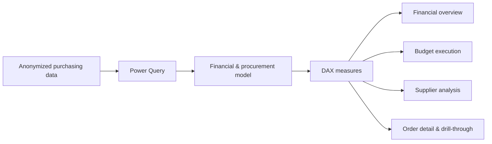
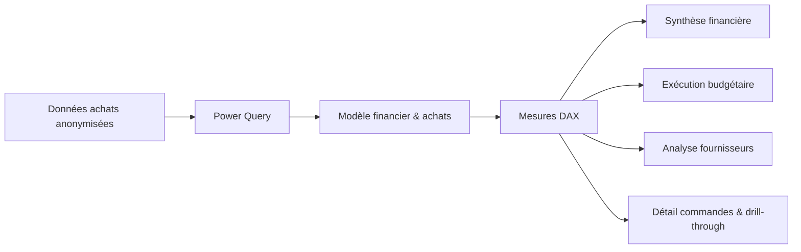

# Power BI Financial Pilotage Portfolio

[English](#english) · [Français](#francais)

---

# 🇬🇧 English

> **Financial steering dashboard for budget execution, purchasing commitments, supplier monitoring and end-to-end purchase-order tracking.**

## Professional context

This project is an **anonymized portfolio reconstruction based on financial steering, procurement reporting and budget-monitoring work I carried out during my professional experience at ENGIE**.

It reflects the type of reporting I used to transform purchasing and financial data into decision-support dashboards for operational and management teams: budget monitoring, purchase commitments, supplier follow-up, order status and transaction-level investigation.

The public portfolio version preserves the analytical approach, KPI logic and reporting structure while protecting confidential information.

> This is **not an official ENGIE deliverable**. Company-sensitive data, supplier names, business identifiers, source systems and operational details have been anonymized, modified or recreated for public presentation.

## Project

➡️ **[Open the Power BI report](./dashboard/Portfolio_Pilotage_Financier.pbix)**

## Dashboard preview

  

> **Main view:** executive financial overview combining budget, ordered, received, invoiced, overdue and remaining-budget indicators.

---

## Business objective

The goal of this project is to turn purchasing and financial data into a clear management tool that connects **budget execution, procurement commitments, supplier activity and order-level traceability**.

The dashboard helps answer questions such as:

- How much budget is available, committed and still remaining?
- How are purchasing commitments evolving month by month?
- How much has been ordered, received and invoiced?
- Which amounts are overdue or still waiting for completion?
- Which suppliers represent the highest purchasing commitments?
- How many suppliers and purchase orders are active?
- Which orders are still awaiting receipt or invoicing?
- Which individual transactions explain a supplier or status-level variance?

---

## Dashboard walkthrough

### 1. Financial overview

**What a recruiter should notice**

- Executive KPI layer covering **Budget, Ordered, Received, Invoiced, Overdue and Remaining Budget**
- Monthly comparison between budget and ordered amounts
- Financial-cycle visualization linking the main stages of purchasing execution
- Order-value distribution by status
- Period filtering for consistent time-based analysis
- Management-oriented layout designed for rapid reading

This page acts as the financial cockpit of the report. It gives management a concise view of the current financial position before moving into detailed budget, supplier or transaction analysis.

---

### 2. Budget execution

**What a recruiter should notice**

- Selected-budget KPI
- Ordered commitments
- Remaining budget
- Budget consumption rate
- Monthly budget-versus-commitment trajectory
- Detailed monthly monitoring table
- Period filter to analyse different financial horizons

This page focuses on **budget execution over time**. It makes it easier to identify spending trends, budget pressure and periods requiring closer monitoring.

---

### 3. Suppliers & commitments

**What a recruiter should notice**

- Number of active suppliers
- Number of distinct purchase orders
- Amounts still waiting to be received
- Amounts to be invoiced after receipt
- Top-10 supplier analysis by ordered amount
- Commitment distribution by status
- Supplier monitoring table with filtering by supplier and period

This page links financial steering with **procurement and supplier analysis**, helping users understand where commitments are concentrated and which suppliers or order statuses require attention.

---

### 4. Purchase-order detail

**What a recruiter should notice**

- Transaction-level traceability
- Filters for supplier, period and order status
- Supplier drill-through capability
- Detailed transaction table for investigating discrepancies
- Direct transition from aggregated KPIs to individual purchasing records

This page supports detailed analysis and investigation. A user can move from a high-level supplier or financial indicator to the transactions behind it.

---

## Main analytical areas

| Area | Purpose |
|---|---|
| **Financial cockpit** | Consolidated view of budget, commitments, receipts, invoices, overdue amounts and remaining budget |
| **Budget execution** | Monthly budget consumption and commitment trajectory |
| **Procurement monitoring** | Purchase-order volumes, statuses and financial commitments |
| **Supplier analysis** | Supplier concentration, active suppliers and outstanding commitments |
| **Transaction detail** | Drill-through and order-level investigation |
| **Time analysis** | Period-based filtering and monthly evolution |
| **Management reporting** | Fast executive reading supported by operational detail |

The report contains **4 main business pages**: Financial Overview, Budget Execution, Suppliers & Commitments, and Purchase-Order Detail.

---

## Analytical flow

## Key capabilities demonstrated

| Area | Demonstrated capability |
|---|---|
| **Data preparation** | Structuring and transforming purchasing and financial data with Power Query |
| **Data modeling** | Building a model suitable for budget, supplier, status and time analysis |
| **DAX** | Financial KPIs, budget consumption, remaining-budget and purchasing measures |
| **Financial analysis** | Budget execution, commitments, receipts, invoices and overdue monitoring |
| **Procurement analytics** | Purchase-order and supplier monitoring |
| **Drill-through analysis** | Moving from executive KPIs to detailed transaction-level investigation |
| **UX / reporting** | Clear hierarchy between executive indicators and operational detail |
| **Data privacy** | Portfolio-safe anonymized and recreated business data |

## Files

- **Power BI report:** `dashboard/Portfolio_Pilotage_Financier.pbix`
- **Anonymized dataset:** `data/Portfolio_Commandes_Anonymise.xlsx`
- **Dashboard screenshots:** `assets/`
- **Integrity checks:** `SHA256SUMS.txt`

## Tech stack

**Power BI Desktop · Power Query · DAX · Microsoft Excel**

## Data privacy

This repository is a public portfolio version. Supplier names, identifiers and business data shown in the report are anonymized, modified or recreated and do not expose confidential ENGIE information.

---

# 🇫🇷 Français

> **Tableau de bord de pilotage financier dédié à l'exécution budgétaire, aux engagements achats, au suivi fournisseurs et à la traçabilité des commandes.**

## Contexte professionnel

Ce projet est une **reconstruction portfolio anonymisée basée sur des travaux de pilotage financier, de reporting achats et de suivi budgétaire que j'ai réalisés dans le cadre de mon expérience professionnelle chez ENGIE**.

Il reflète le type de reporting que j'ai utilisé pour transformer des données achats et financières en tableaux de bord d'aide à la décision pour les équipes opérationnelles et le management : suivi budgétaire, engagements de commandes, suivi fournisseurs, statuts des commandes et analyse détaillée des transactions.

Cette version publique conserve l'approche analytique, la logique des KPI et la structure du reporting tout en protégeant les informations confidentielles.

> Il ne s'agit **pas d'un livrable officiel ENGIE**. Les données sensibles, noms de fournisseurs, identifiants métier, systèmes sources et informations opérationnelles ont été anonymisés, modifiés ou recréés pour une présentation publique.

## Projet

➡️ **[Ouvrir le rapport Power BI](./dashboard/Portfolio_Pilotage_Financier.pbix)**

## Aperçu du dashboard

  

> **Vue principale :** synthèse financière combinant budget, commandé, réceptionné, facturé, échu et reste budgétaire.

---

## Objectif métier

L'objectif de ce projet est de transformer les données achats et financières en un outil de pilotage clair reliant **exécution budgétaire, engagements achats, activité fournisseurs et traçabilité des commandes**.

Le dashboard permet notamment de répondre rapidement aux questions suivantes :

- Quel budget est disponible, engagé et encore restant ?
- Comment les engagements achats évoluent-ils mois par mois ?
- Quels montants ont été commandés, réceptionnés et facturés ?
- Quels montants sont échus ou encore en attente de finalisation ?
- Quels fournisseurs concentrent les engagements les plus importants ?
- Combien de fournisseurs et de commandes sont actifs ?
- Quelles commandes restent à réceptionner ou à facturer ?
- Quelles transactions individuelles expliquent un écart observé au niveau d'un fournisseur ou d'un statut ?

---

## Présentation des vues

### 1. Synthèse financière

**Ce qu'un recruteur peut identifier immédiatement**

- Couche de KPI exécutifs : **Budget, Commandé, Réceptionné, Facturé, Échu et Reste budgétaire**
- Comparaison mensuelle entre budget et montant commandé
- Visualisation du cycle financier des commandes
- Répartition des montants commandés par état
- Filtre de période pour conserver une analyse temporelle cohérente
- Mise en page pensée pour une lecture rapide par le management

Cette page constitue le cockpit financier du rapport. Elle permet d'obtenir immédiatement la position financière globale avant de descendre vers l'analyse du budget, des fournisseurs ou des transactions.

---

### 2. Exécution budgétaire

**Ce qu'un recruteur peut identifier immédiatement**

- Budget sélectionné
- Engagements commandés
- Reste budgétaire
- Taux de consommation
- Trajectoire mensuelle budget / engagements
- Tableau de suivi mensuel détaillé
- Filtre de période pour analyser différents horizons financiers

Cette page est centrée sur **l'exécution du budget dans le temps**. Elle facilite l'identification des tendances de dépenses, de la pression budgétaire et des périodes nécessitant une attention particulière.

---

### 3. Fournisseurs & engagements

**Ce qu'un recruteur peut identifier immédiatement**

- Nombre de fournisseurs actifs
- Nombre de commandes distinctes
- Montants restant à réceptionner
- Montants à facturer après réception
- Top 10 des fournisseurs par montant commandé
- Répartition des engagements par état
- Tableau de suivi fournisseurs avec filtres fournisseur et période

Cette page relie le pilotage financier à **l'analyse achats et fournisseurs**, afin de comprendre où se concentrent les engagements et quels fournisseurs ou statuts nécessitent une attention particulière.

---

### 4. Détail des commandes

**Ce qu'un recruteur peut identifier immédiatement**

- Traçabilité au niveau transactionnel
- Filtres fournisseur, période et état
- Drill-through fournisseur
- Tableau détaillé pour l'investigation des écarts
- Passage direct d'un KPI agrégé au détail des commandes concernées

Cette page permet d'approfondir l'analyse. L'utilisateur peut partir d'un indicateur financier ou fournisseur et retrouver les transactions qui expliquent le résultat.

---

## Principaux axes d'analyse

| Axe | Utilité |
|---|---|
| **Cockpit financier** | Vue consolidée du budget, des engagements, réceptions, factures, échus et reste budgétaire |
| **Exécution budgétaire** | Consommation mensuelle et trajectoire des engagements |
| **Suivi achats** | Volumétrie, statuts et engagements des commandes |
| **Analyse fournisseurs** | Concentration des dépenses, fournisseurs actifs et engagements en attente |
| **Détail transactionnel** | Drill-through et investigation commande par commande |
| **Analyse temporelle** | Filtres de période et évolution mensuelle |
| **Reporting management** | Lecture exécutive rapide complétée par le détail opérationnel |

Le rapport contient **4 pages métier principales** : Synthèse financière, Exécution budgétaire, Fournisseurs & engagements et Détail des commandes.

---

## Flux analytique

## Compétences démontrées

| Domaine | Compétence démontrée |
|---|---|
| **Préparation des données** | Structuration et transformation de données achats et financières avec Power Query |
| **Modélisation** | Modèle adapté aux analyses budget, fournisseurs, statuts et périodes |
| **DAX** | KPI financiers, consommation budgétaire, reste budgétaire et mesures achats |
| **Analyse financière** | Budget, engagements, réceptions, facturation et montants échus |
| **Analyse achats** | Suivi des commandes et des fournisseurs |
| **Drill-through** | Passage des KPI exécutifs au détail transactionnel |
| **UX / Reporting** | Hiérarchie claire entre indicateurs management et données opérationnelles |
| **Confidentialité** | Données anonymisées et recréées pour une présentation portfolio publique |

## Fichiers

- **Rapport Power BI :** `dashboard/Portfolio_Pilotage_Financier.pbix`
- **Jeu de données anonymisé :** `data/Portfolio_Commandes_Anonymise.xlsx`
- **Captures du dashboard :** `assets/`
- **Contrôles d'intégrité :** `SHA256SUMS.txt`

## Stack technique

**Power BI Desktop · Power Query · DAX · Microsoft Excel**

## Confidentialité

Ce dépôt est une version portfolio publique. Les noms de fournisseurs, identifiants et données métier affichés ont été anonymisés, modifiés ou recréés et n'exposent aucune information confidentielle ENGIE.
