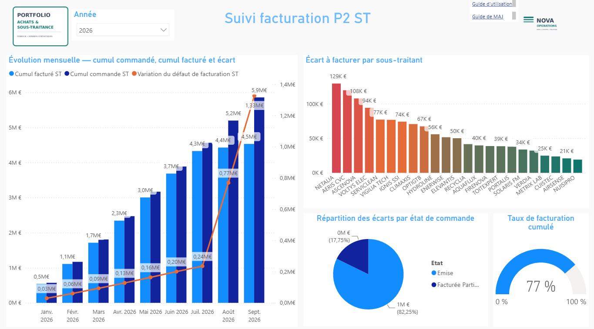
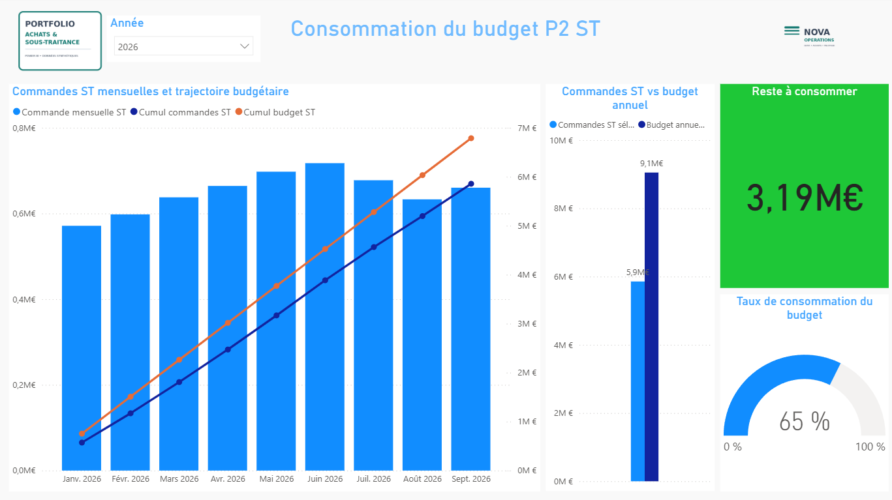
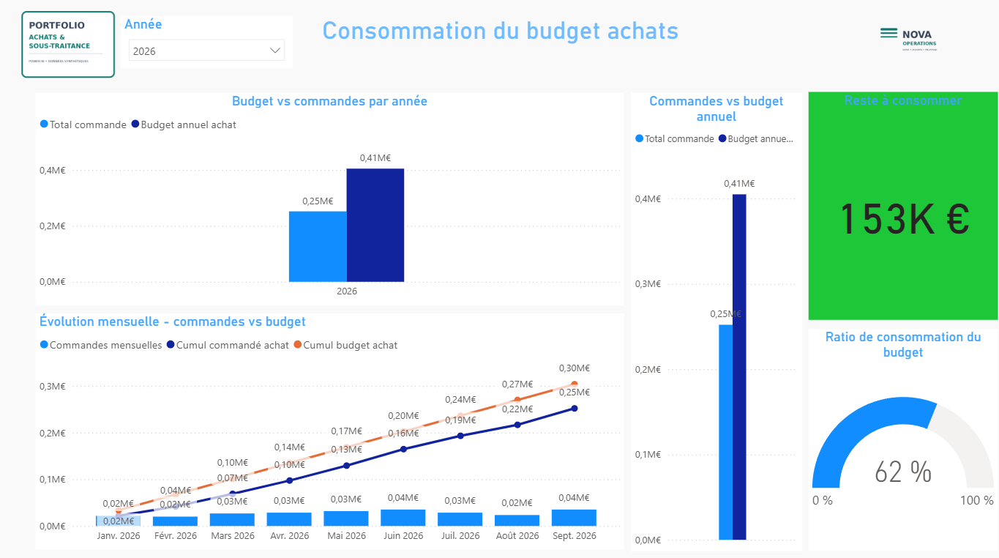
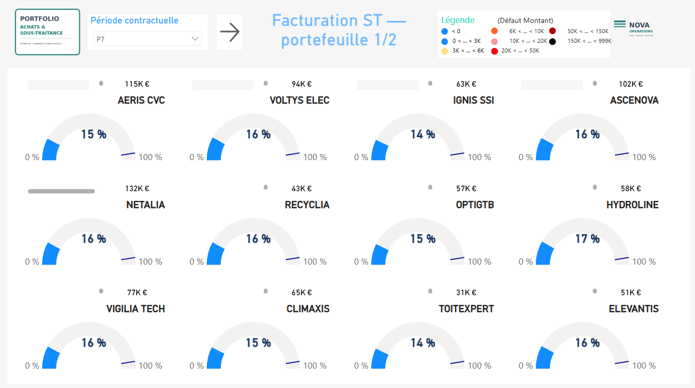
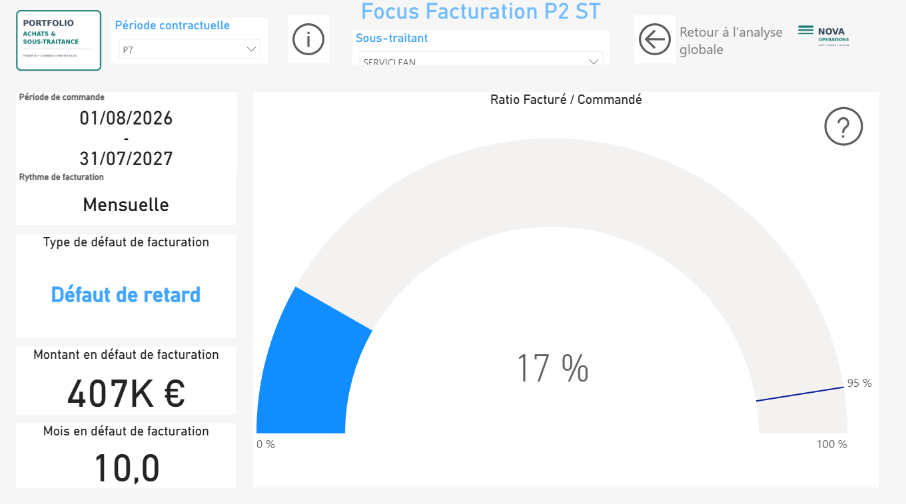
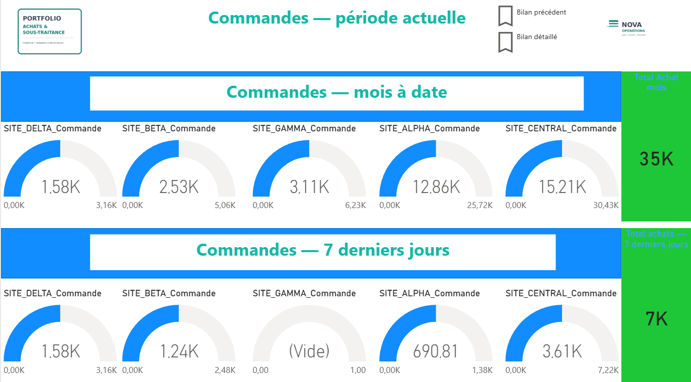
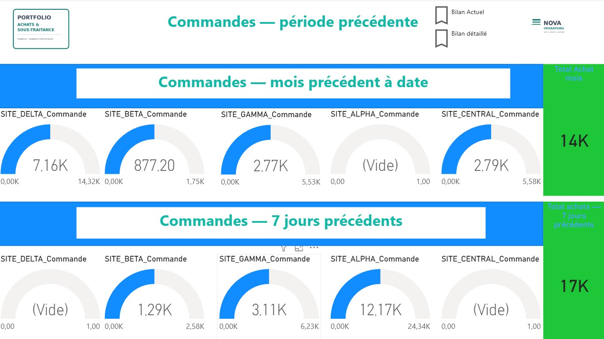
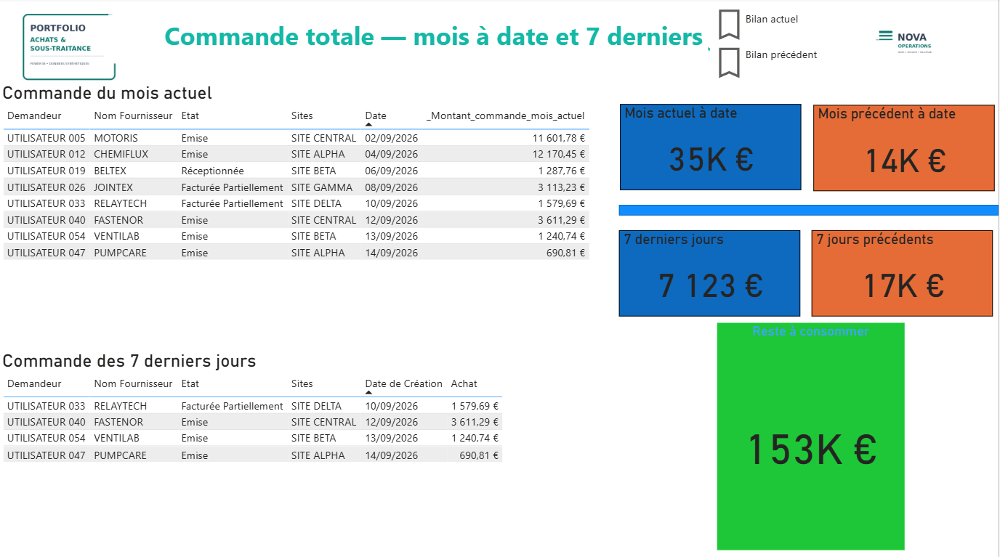
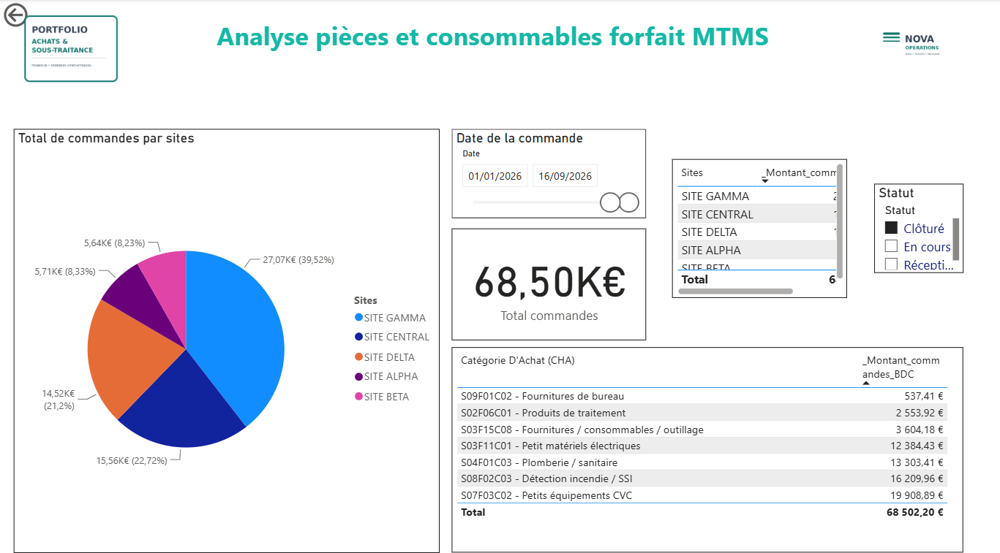
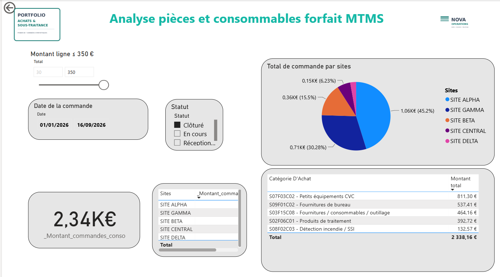

# P2 Consumables Financial Monitoring

[English](#english) · [Français](#francais)

---

<a id="english"></a>

# 🇬🇧 English

> **Power BI portfolio project for procurement, consumables, subcontracting commitments, budget consumption and invoicing monitoring.**


## Professional context

This project is an **anonymized portfolio adaptation of procurement, subcontracting, budget and invoicing monitoring work I carried out during my professional experience at ENGIE**.

The public version was rebuilt with synthetic/anonymized data so the analytical approach, KPI logic, dashboard structure and business use cases can be presented without exposing confidential production information.

> This is **not an official ENGIE deliverable**. Supplier names, site names, identifiers, values and operational details have been anonymized, modified or recreated for public presentation.

## Business objective

The dashboard connects purchasing activity, consumables, subcontracting commitments, annual budgets and invoicing progress in a single decision-support model.

It supports questions such as:

- How much of the annual procurement or subcontracting budget has been consumed?
- How much budget remains available?
- How do monthly commitments evolve?
- Are cumulative orders aligned with the annual budget trajectory?
- What proportion of subcontracting commitments has been invoiced?
- Which subcontractors generate the largest invoicing gaps?
- How are consumables distributed by site, status and purchasing category?
- How do current periods compare with equivalent previous periods?
- Which low-value orders require specific monitoring?

## Dashboard previews

The final portfolio contains **10 dashboard views**, from executive financial steering to operational purchasing detail.

### 1. Subcontracting invoicing overview



Executive monitoring of subcontracting commitments and invoicing progress: ordered vs. invoiced amounts, cumulative trends, invoicing gap and portfolio KPIs.

### 2. Subcontracting budget consumption



Annual P2 subcontracting budget monitoring with monthly commitments, cumulative orders, budget trajectory, remaining budget and consumption rate.

### 3. Procurement budget consumption



Purchasing-budget steering view combining annual budget, ordered amount, monthly activity, cumulative trajectory and remaining purchasing capacity.

### 4. Subcontractor portfolio — overview



Portfolio-level comparison of subcontractors using commitment and invoicing indicators to identify the largest financial gaps.

### 5. Subcontractor portfolio — detailed analysis



Supplier-level analysis for comparing invoicing progress, outstanding exposure and financial position across the subcontracting portfolio.

### 6. Invoicing focus



Focused analysis of a selected subcontractor and period, including invoiced/ordered ratio, monthly evolution and the remaining invoicing gap.

### 7. Monthly and recent-order review



Operational purchasing review covering current-month activity and recent orders, with transaction-level visibility and period KPIs.

### 8. Comparable-period analysis



Period-over-period comparison designed to distinguish real purchasing evolution from calendar effects and keep current-versus-previous-period KPIs coherent.

### 9. Parts and consumables analysis



Detailed analysis of parts and consumables by site, status and purchasing category, with amount, line count, average basket and monthly evolution.

### 10. Small-purchase analysis



Dedicated monitoring of low-value orders (≤ €350), highlighting volume, spend, average basket, closure rate, site distribution and monthly trend.

## Financial and time logic

The model uses a shared calendar so the selected year consistently filters procurement, consumables and subcontracting measures.

The portfolio includes:

- monthly and cumulative subcontracting orders;
- cumulative invoiced amount;
- annual procurement and subcontracting budgets;
- cumulative budget trajectories;
- remaining budget;
- budget-consumption ratios;
- ordered vs. invoiced ratios;
- current / previous period comparisons;
- multi-year reconciliation from **2020 to 2026**.

The synthetic snapshot is capped at **16 September 2026** so future demonstration rows are not treated as completed activity.

## 2026 validation snapshot

| KPI | Value |
|---|---:|
| Procurement ordered | €252.11K |
| Procurement annual budget | €405.00K |
| Procurement budget consumption | 62.25% |
| Procurement remaining budget | €152.89K |
| Subcontracting ordered | €5.857M |
| Subcontracting invoiced | €4.531M |
| Subcontracting annual budget | €9.050M |
| Subcontracting budget consumption | 64.72% |
| Subcontracting invoicing ratio | 77.36% |
| Subcontracting remaining budget | €3.193M |

## Key capabilities demonstrated

| Area | Demonstrated capability |
|---|---|
| Data preparation | Power Query transformations and portable synthetic sources |
| Data modeling | Shared calendar, suppliers, budgets and purchasing model |
| DAX | Cumulative measures, budget ratios, invoicing ratios and period comparisons |
| Financial monitoring | Budget consumption, remaining budget and commitment trajectory |
| Procurement analytics | Orders, consumables, sites, categories and low-value purchases |
| Subcontracting analytics | Commitment and invoicing monitoring by period and subcontractor |
| Data quality | Multi-year reconciliation and consistency controls |
| UX / reporting | Executive KPIs combined with operational drill-down |
| Source control | PBIP / TMDL source organized for Git |

## Repository structure

```text
powerbi-p2-consumables-financial-monitoring/
├── assets/                 # 10 final dashboard screenshots
├── dashboard/
│   ├── P2_Consumables_Financial_Monitoring.pbip
│   ├── report/
│   └── semantic-model/
├── data/                   # 6 synthetic Excel source workbooks
├── docs/                   # methodology and reconciliation checks
├── model/                  # recruiter-readable TMDL extracts
├── setup-local.cmd
├── setup-local.ps1
├── README.md
└── SHA256SUMS.txt
```

## Windows-safe local setup

PBIP projects can contain deeply nested folders. To avoid Windows path-length errors, run:

```text
setup-local.cmd
```

The script reconstructs the project in:

```text
%USERPROFILE%\P2
```

Then open:

```text
%USERPROFILE%\P2\P2_Consumables_Financial_Monitoring.pbip
```

See **[dashboard/README.md](./dashboard/README.md)** for the reconstruction details.

## Tech stack

**Power BI Desktop · Power Query · DAX · PBIP / TMDL · Microsoft Excel**

## Data privacy

This is a public portfolio version. Supplier names, sites, identifiers and values are fictitious, anonymized or modified. No confidential production dataset is intentionally published.

---

<a id="francais"></a>

# 🇫🇷 Français

> **Projet Power BI de pilotage financier couvrant les achats, les consommables, les engagements de sous-traitance, la consommation budgétaire et le suivi de facturation.**

## Contexte professionnel

Ce projet est une **adaptation portfolio anonymisée de travaux de suivi achats, sous-traitance, budget et facturation que j'ai réalisés dans le cadre de mon expérience professionnelle chez ENGIE**.

La version publique a été reconstruite avec des données synthétiques/anonymisées afin de présenter l'approche analytique, la logique des KPI, la structure du dashboard et les cas d'usage métier sans exposer d'informations confidentielles de production.

> Il ne s'agit **pas d'un livrable officiel ENGIE**. Les fournisseurs, sites, identifiants, montants et informations opérationnelles ont été anonymisés, modifiés ou recréés pour cette présentation publique.

## Objectif métier

Le dashboard relie dans un même modèle de pilotage :

- l'activité achats ;
- les pièces et consommables ;
- les engagements de sous-traitance ;
- les budgets annuels ;
- l'avancement de la facturation ;
- les comparaisons de périodes ;
- le détail opérationnel des commandes.

Il permet notamment de suivre la consommation des budgets, le reste disponible, les commandes mensuelles et cumulées, le taux de facturation, les écarts par sous-traitant, les consommables par site/catégorie et les petites commandes.

## Aperçus du dashboard

Le portfolio final contient **10 vues**, depuis le pilotage financier de synthèse jusqu'au détail opérationnel.

### 1. Vue d'ensemble de la facturation sous-traitance


Pilotage global des engagements de sous-traitance et de l'avancement de la facturation : commandé vs facturé, tendances cumulées, écart de facturation et principaux KPI du portefeuille.

### 2. Consommation du budget sous-traitance


Suivi du budget annuel P2 sous-traitance avec engagements mensuels, cumul des commandes, trajectoire budgétaire, reste disponible et taux de consommation.

### 3. Consommation du budget achats


Vue de pilotage du budget achats combinant budget annuel, montant commandé, activité mensuelle, trajectoire cumulée et capacité d'achat restante.

### 4. Portefeuille sous-traitants — synthèse


Comparaison du portefeuille de sous-traitants avec indicateurs d'engagement et de facturation afin d'identifier rapidement les principaux écarts financiers.

### 5. Portefeuille sous-traitants — analyse détaillée


Analyse par fournisseur permettant de comparer l'avancement de la facturation, les montants restant à traiter et la situation financière de chaque sous-traitant.

### 6. Focus facturation


Vue ciblée sur un sous-traitant et une période sélectionnés : ratio facturé/commandé, évolution mensuelle et analyse de l'écart restant.

### 7. Revue mensuelle et commandes récentes


Revue opérationnelle des achats couvrant l'activité du mois et les commandes récentes, avec visibilité transactionnelle et KPI de période.

### 8. Analyse des périodes comparables


Comparaison période actuelle / période précédente afin de distinguer l'évolution réelle des achats des effets calendaires et de conserver des KPI cohérents.

### 9. Analyse pièces et consommables


Analyse détaillée des pièces et consommables par site, statut et catégorie d'achat, avec montant, nombre de lignes, panier moyen et évolution mensuelle.

### 10. Analyse des petites commandes


Vue dédiée aux commandes de faible montant (≤ 350 €), avec volumétrie, montant, panier moyen, taux de clôture, répartition par site et tendance mensuelle.

## Logique financière et temporelle

Le modèle utilise un calendrier commun afin que l'année sélectionnée filtre de manière cohérente les mesures achats, consommables et sous-traitance.

Le portfolio couvre notamment :

- commandes ST mensuelles et cumulées ;
- facturation cumulée ;
- budgets annuels achats et sous-traitance ;
- trajectoires budgétaires cumulées ;
- reste à consommer ;
- taux de consommation ;
- ratio facturé / commandé ;
- comparaisons période actuelle / précédente ;
- contrôles multi-années de **2020 à 2026**.

Le snapshot synthétique est arrêté au **16 septembre 2026** afin de ne pas traiter les lignes futures comme de l'activité réalisée.

## Validation 2026

| KPI | Valeur |
|---|---:|
| Commandes achats | 252,11 K€ |
| Budget achats annuel | 405,00 K€ |
| Taux de consommation achats | 62,25 % |
| Reste achats | 152,89 K€ |
| Commandes ST | 5,857 M€ |
| Facturé ST | 4,531 M€ |
| Budget ST annuel | 9,050 M€ |
| Taux de consommation ST | 64,72 % |
| Taux de facturation ST | 77,36 % |
| Reste ST | 3,193 M€ |

## Compétences démontrées

- Power Query et préparation des données
- DAX et conception de KPI
- modélisation sémantique
- calendrier commun et filtres annuels cohérents
- pilotage budgétaire achats / sous-traitance
- suivi commandé / facturé
- analyse multi-sites et fournisseurs
- analyse des consommables et petites commandes
- contrôles de cohérence multi-années
- PBIP / TMDL et organisation Git
- datavisualisation orientée management

## Structure du projet

```text
powerbi-p2-consumables-financial-monitoring/
├── assets/                 # 10 captures finales du dashboard
├── dashboard/
│   ├── P2_Consumables_Financial_Monitoring.pbip
│   ├── report/
│   └── semantic-model/
├── data/                   # 6 fichiers Excel synthétiques
├── docs/
├── model/
├── setup-local.cmd
├── setup-local.ps1
├── README.md
└── SHA256SUMS.txt
```

## Installation locale Windows

Pour éviter les erreurs Windows liées aux chemins trop longs, exécuter :

```text
setup-local.cmd
```

Le projet est reconstruit automatiquement dans :

```text
%USERPROFILE%\P2
```

Puis ouvrir :

```text
%USERPROFILE%\P2\P2_Consumables_Financial_Monitoring.pbip
```

Voir **[dashboard/README.md](./dashboard/README.md)** pour le détail de la reconstruction.

## Stack technique

**Power BI Desktop · Power Query · DAX · PBIP / TMDL · Microsoft Excel**

## Confidentialité

Cette version est destinée à un portfolio public. Les noms de fournisseurs, sites, identifiants et montants sont fictifs, anonymisés ou modifiés. Aucune donnée confidentielle de production n'est volontairement publiée.
