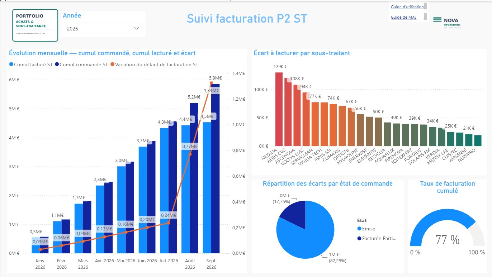
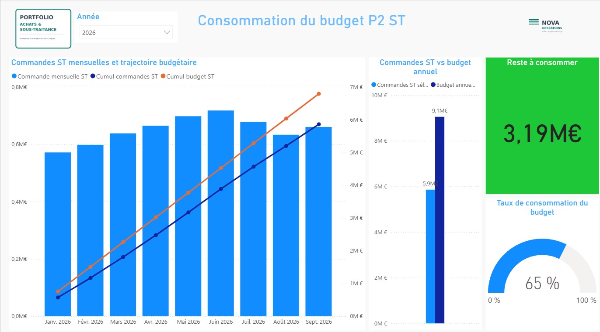
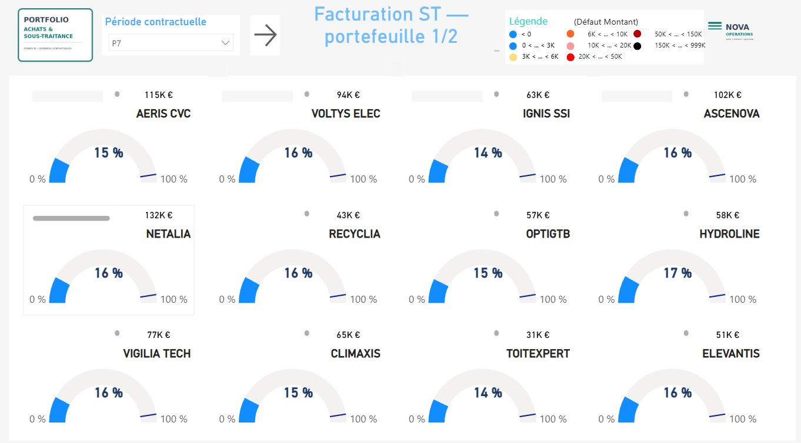
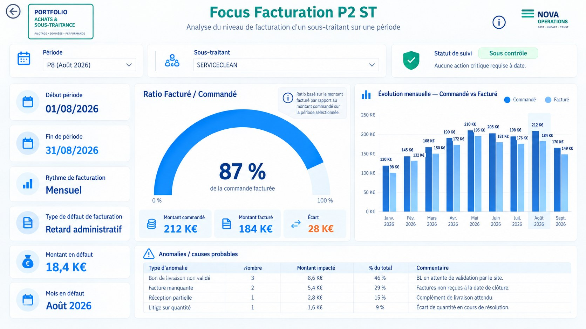
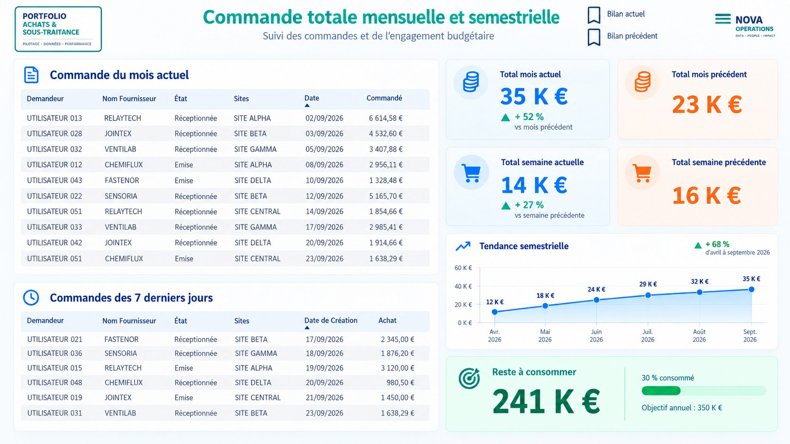
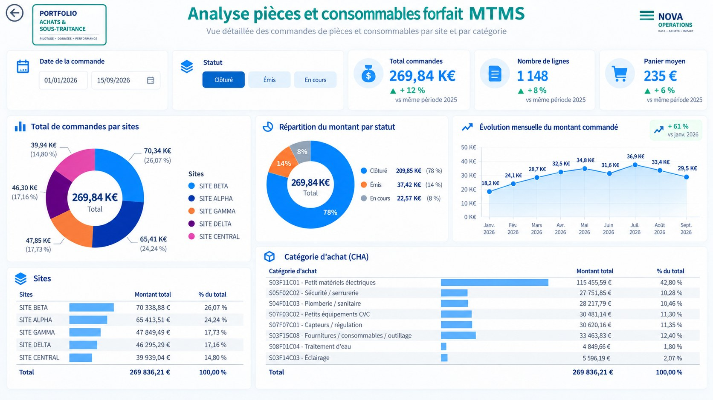
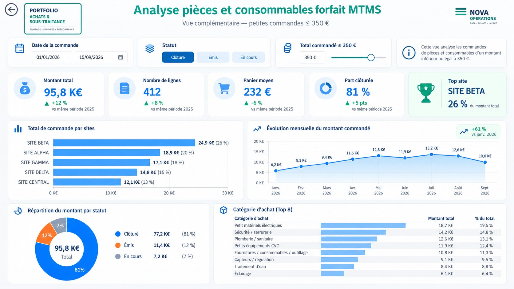

# P2 Consumables Financial Monitoring

[English](#english) · [Français](#francais)

---

<a id="english"></a>

# 🇬🇧 English

> **Power BI portfolio project for P2 procurement, consumables, subcontracting commitments, budget consumption and invoicing monitoring.**


## Professional context

This project is an **anonymized portfolio reconstruction inspired by procurement, subcontracting and financial-monitoring solutions I developed during my professional experience at ENGIE**.

It demonstrates business analysis, financial steering, KPI design, Power Query, DAX, semantic modeling and Power BI reporting while protecting confidential information.

> This is **not an official ENGIE deliverable**. Supplier names, site names, identifiers, values and operational details have been anonymized, modified or recreated for public presentation. The portfolio dataset is synthetic.

## Business objective

The dashboard connects purchasing activity, consumables, subcontracting commitments, annual budgets and invoicing progress in one decision-support model.

It helps answer questions such as:

- How much of the annual procurement or subcontracting budget has been consumed?
- How much budget remains available?
- How do monthly orders evolve across the selected year?
- Are cumulative commitments aligned with the budget trajectory?
- What proportion of subcontracting commitments has been invoiced?
- Which subcontractors generate the largest invoicing gaps?
- How are consumables distributed by site, status and category?
- Do filters and measures remain coherent from 2020 through the current 2026 snapshot?

## Dashboard previews

### 1. Subcontracting invoicing follow-up



- cumulative ordered vs. invoiced amounts;
- invoicing gap by subcontractor;
- gap distribution by order status;
- cumulative invoicing rate;
- year filter based on a shared calendar.

### 2. P2 subcontracting budget consumption



- monthly subcontracting orders;
- cumulative orders;
- cumulative budget trajectory;
- annual budget comparison;
- remaining budget and consumption rate.

### 3. Procurement budget consumption


- annual procurement budget vs. ordered amount;
- monthly purchasing activity;
- cumulative procurement trajectory;
- remaining annual budget;
- budget-consumption ratio.

### 4. Subcontractor portfolio view



- supplier-level invoicing gaps;
- portfolio comparison;
- contractual-period selector;
- invoicing progress by subcontractor.

### 5. Invoicing focus



- ordered vs. invoiced ratio;
- selected subcontractor analysis;
- monthly ordered / invoiced comparison;
- anomaly and root-cause breakdown.

### 6. Monthly and weekly purchasing review



- current-month orders;
- last-seven-days review;
- current vs. previous period KPIs;
- semester trend;
- remaining annual purchasing capacity.

### 7. Consumables and parts analysis



- amount, line count and average basket;
- site distribution;
- status distribution;
- monthly trend;
- purchasing-category analysis.

### 8. Small-purchase analysis — orders ≤ €350



- low-value purchasing analysis;
- site and category distribution;
- closure rate and average basket;
- monthly trend with the same calendar logic.

## Financial and time logic

The model uses a shared calendar so the selected year consistently filters procurement, consumables and subcontracting measures.

The portfolio includes:

- monthly and cumulative subcontracting orders;
- cumulative invoiced amount;
- annual procurement and subcontracting budgets;
- cumulative budget trajectories;
- remaining budget;
- budget-consumption ratios;
- ordered vs. invoiced ratios;
- current / previous period comparisons;
- multi-year reconciliation from **2020 to 2026**.

The synthetic snapshot is capped at **16 September 2026** so future demonstration rows are not treated as completed activity.

## 2026 validation snapshot

| KPI | Value |
|---|---:|
| Procurement ordered | €252.11K |
| Procurement annual budget | €405.00K |
| Procurement budget consumption | 62.25% |
| Procurement remaining budget | €152.89K |
| Subcontracting ordered | €5.857M |
| Subcontracting invoiced | €4.531M |
| Subcontracting annual budget | €9.050M |
| Subcontracting budget consumption | 64.72% |
| Subcontracting invoicing ratio | 77.36% |
| Subcontracting remaining budget | €3.193M |

## Repository structure

```text
powerbi-p2-consumables-financial-monitoring/
├── assets/                 # 8 dashboard screenshots
├── dashboard/
│   ├── P2_Consumables_Financial_Monitoring.pbip
│   ├── report/             # report definition, resources and custom visuals
│   └── semantic-model/     # complete semantic-model source archive
├── data/                   # 6 synthetic Excel source workbooks
├── docs/                   # methodology and reconciliation checks
├── model/                  # recruiter-readable TMDL extracts
├── .gitattributes
├── .gitignore
├── README.md
└── SHA256SUMS.txt
```

## Power BI source

See **[dashboard/README.md](./dashboard/README.md)** for the PBIP reconstruction instructions.

The public repository stores the PBIP source in several small archives so the folder remains readable and GitHub-friendly while preserving the report definition, semantic model, static resources and custom visuals.

## Key capabilities demonstrated

| Area | Demonstrated capability |
|---|---|
| Data preparation | Power Query transformations and portable synthetic sources |
| Data modeling | Shared calendar, supplier, budget and purchasing model |
| DAX | Cumulative measures, budget ratios, invoicing ratios and period comparisons |
| Financial monitoring | Budget consumption, remaining budget and commitment trajectory |
| Procurement analytics | Orders, consumables, sites, categories and low-value purchases |
| Subcontracting analytics | Commitment and invoicing follow-up by period and subcontractor |
| Data quality | Multi-year reconciliation and consistency controls |
| UX / reporting | Executive KPIs combined with operational drill-down |
| Source control | PBIP / TMDL source organized for Git |

## Tech stack

**Power BI Desktop · Power Query · DAX · PBIP / TMDL · Microsoft Excel**

## Data privacy

This is a public portfolio version.

- Supplier and site names are fictitious or anonymized.
- Values and identifiers are synthetic or modified for public demonstration.
- No confidential production dataset is intentionally published.
- The project demonstrates analytical methods and business logic rather than reproducing a live production environment.

---

<a id="francais"></a>

# 🇫🇷 Français

> **Projet Power BI de suivi financier P2 couvrant les achats, les consommables, les engagements de sous-traitance, la consommation budgétaire et la facturation.**

## Contexte professionnel

Ce projet est une **reconstruction portfolio anonymisée inspirée de solutions de suivi achats, sous-traitance et pilotage financier que j'ai développées dans le cadre de mon expérience professionnelle chez ENGIE**.

Il présente des compétences en analyse métier, pilotage financier, conception de KPI, Power Query, DAX, modélisation sémantique et reporting Power BI, tout en protégeant les informations confidentielles.

> Il ne s'agit **pas d'un livrable officiel ENGIE**. Les fournisseurs, sites, identifiants, montants et informations opérationnelles ont été anonymisés, modifiés ou recréés pour une présentation publique. Les données portfolio sont synthétiques.

## Objectif métier

Le dashboard relie l'activité achats, les consommables, les engagements de sous-traitance, les budgets annuels et l'avancement de la facturation dans un même modèle de pilotage.

Il permet notamment de suivre :

- la consommation du budget achats et sous-traitance ;
- le budget restant disponible ;
- les commandes mensuelles et leurs cumuls ;
- la trajectoire budgétaire ;
- le taux de facturation des engagements ;
- les écarts de facturation par sous-traitant ;
- les consommables par site, statut et catégorie ;
- la cohérence des mesures et filtres de 2020 à 2026.

## Aperçus du dashboard

### 1. Suivi de facturation sous-traitance


### 2. Consommation du budget P2 ST


### 3. Consommation du budget achats


### 4. Portefeuille de sous-traitants


### 5. Focus facturation


### 6. Bilan mensuel et hebdomadaire des commandes


### 7. Analyse pièces et consommables


### 8. Petites commandes — ≤ 350 €


## Logique financière et temporelle

Le modèle utilise un calendrier commun afin que l'année sélectionnée filtre de manière cohérente les mesures achats, consommables et sous-traitance.

Le portfolio couvre notamment :

- commandes ST mensuelles et cumulées ;
- facturation cumulée ;
- budgets annuels achats et sous-traitance ;
- trajectoires budgétaires cumulées ;
- reste à consommer ;
- taux de consommation ;
- ratio facturé / commandé ;
- comparaisons période actuelle / précédente ;
- contrôles multi-années de **2020 à 2026**.

Le snapshot synthétique est arrêté au **16 septembre 2026** afin de ne pas traiter les lignes futures comme de l'activité réalisée.

## Validation 2026

| KPI | Valeur |
|---|---:|
| Commandes achats | 252,11 K€ |
| Budget achats annuel | 405,00 K€ |
| Taux de consommation achats | 62,25 % |
| Reste achats | 152,89 K€ |
| Commandes ST | 5,857 M€ |
| Facturé ST | 4,531 M€ |
| Budget ST annuel | 9,050 M€ |
| Taux de consommation ST | 64,72 % |
| Taux de facturation ST | 77,36 % |
| Reste ST | 3,193 M€ |

## Structure du projet

```text
powerbi-p2-consumables-financial-monitoring/
├── assets/                 # 8 captures du dashboard
├── dashboard/
│   ├── P2_Consumables_Financial_Monitoring.pbip
│   ├── report/             # définition du rapport, ressources et visuels
│   └── semantic-model/     # source complète du modèle sémantique
├── data/                   # 6 classeurs Excel synthétiques
├── docs/                   # méthodologie et contrôles de cohérence
├── model/                  # extraits TMDL lisibles directement sur GitHub
├── .gitattributes
├── .gitignore
├── README.md
└── SHA256SUMS.txt
```

## Source Power BI

Consulter **[dashboard/README.md](./dashboard/README.md)** pour reconstruire le projet PBIP.

Le dépôt public sépare les éléments PBIP en archives légères afin de conserver une structure GitHub claire tout en gardant la définition du rapport, le modèle sémantique, les ressources statiques et les visuels personnalisés.

## Compétences démontrées

- Power Query et préparation des données
- DAX et conception de KPI
- modélisation sémantique
- calendrier commun et filtres annuels cohérents
- pilotage budgétaire achats / sous-traitance
- suivi commandé / facturé
- analyse multi-sites et fournisseurs
- contrôles de cohérence multi-années
- PBIP / TMDL et organisation Git
- datavisualisation orientée management

## Stack technique

**Power BI Desktop · Power Query · DAX · PBIP / TMDL · Microsoft Excel**

## Confidentialité

- Les fournisseurs et sites sont fictifs ou anonymisés.
- Les montants et identifiants sont synthétiques ou adaptés à la démonstration publique.
- Aucune donnée confidentielle de production n'est volontairement publiée.
