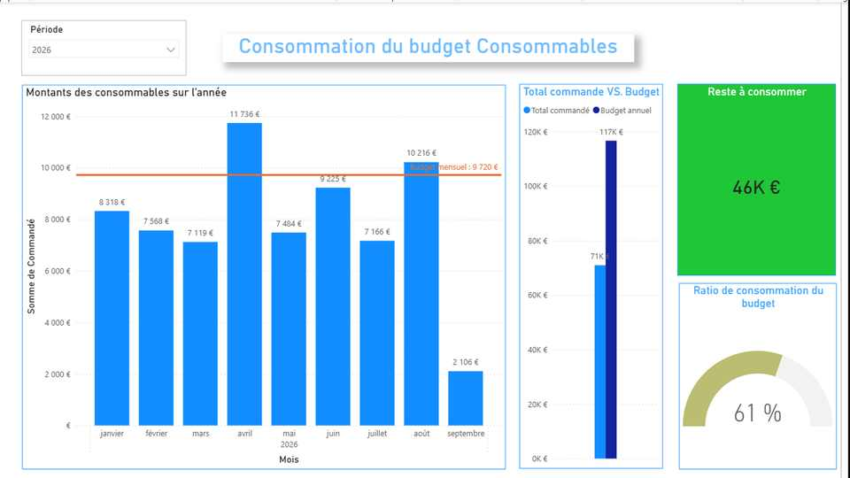
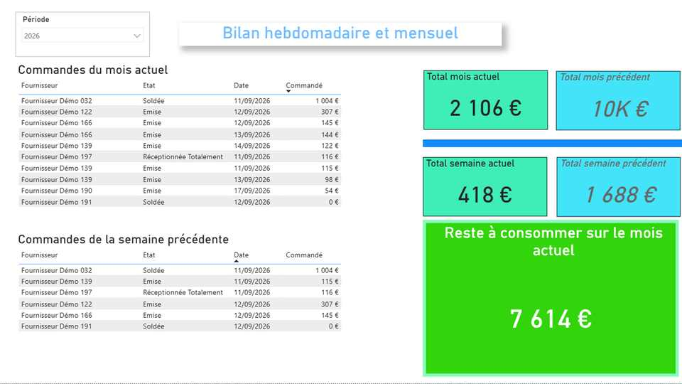
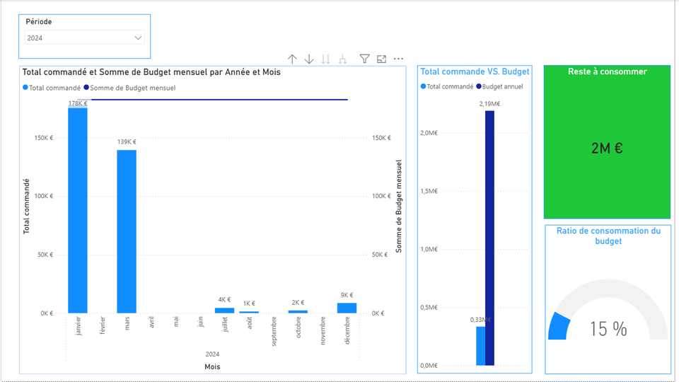

# Power BI Procurement & Budget Dashboard

[English](#english) · [Français](#francais)

---

# 🇬🇧 English

> **Procurement and budget monitoring dashboard designed to make purchasing activity, budget consumption and recurring orders easy to understand at a glance.**

## Project

➡️ **[Open the Power BI project](./dashboard/Procurement_Budget_Dashboard.pbix)**

## Dashboard preview

  

> **Main view:** monthly procurement activity, annual budget comparison, remaining budget and budget consumption ratio.

---

## Business objective

The goal of this project is to transform purchasing data into a practical management tool for operational and budget decision-making.

The dashboard helps answer questions such as:

- How much of the annual budget has already been committed?
- How much budget is still available?
- Which months generate the highest purchasing activity?
- What was ordered during the current month and the previous week?
- How are recurring / duration-based purchase orders consuming their budget?

## Dashboard preview

### 1. Consumables budget consumption

**What a recruiter should notice**

- Monthly purchasing trend with a visible budget reference line
- Comparison between total ordered amount and annual budget
- Remaining budget displayed as a clear management KPI
- Budget consumption ratio for immediate executive reading
- Year filter enabling period-based analysis

This page is designed for fast budget monitoring: a manager can immediately identify whether spending is on track and which months require attention.

---

### 2. Weekly & monthly purchasing review

**What a recruiter should notice**

- Detailed supplier-level purchase-order tracking
- Current-month orders and previous-week orders
- Current vs. previous period comparisons
- Remaining monthly purchasing capacity
- Combination of detailed operational data and high-level KPIs

This page bridges **operational follow-up and management reporting**. It allows users to move from the overall purchasing position to the individual supplier/order level.

---

### 3. Recurring / duration-based orders

**What a recruiter should notice**

- Monitoring of longer-term or recurring purchase commitments
- Monthly ordered amounts against a yearly budget
- Remaining budget and consumption rate
- Clear identification of months with significant spending
- Consistent KPI logic across different purchasing categories

This view demonstrates how the same analytical model can be adapted to another procurement category while keeping a consistent user experience.

---

## Key capabilities demonstrated

| Area | Demonstrated capability |
|---|---|
| **Data preparation** | Structuring and transforming purchasing data with Power Query |
| **Data modeling** | Building a model suitable for time, supplier and budget analysis |
| **DAX** | Budget ratios, period comparisons and KPI calculations |
| **Procurement analytics** | Monitoring orders, suppliers and purchasing commitments |
| **Budget management** | Budget consumption, remaining budget and monthly trends |
| **UX / reporting** | Combining executive KPIs with detailed operational tables |
| **Data privacy** | Portfolio-safe anonymized supplier and business data |

## Files

- **Power BI report:** `dashboard/Procurement_Budget_Dashboard.pbix`
- **Anonymized dataset:** `data/Portfolio_Commandes_Anonymise.xlsx`
- **Dashboard screenshots:** `assets/`
- **Integrity checks:** `SHA256SUMS.txt`

## Tech stack

**Power BI Desktop · Power Query · DAX · Microsoft Excel**

## Data privacy

This repository is a public portfolio version. Supplier names and business identifiers shown in the dashboard are fictitious or anonymized.

---

# 🇫🇷 Français

> **Tableau de bord Achats & Budget conçu pour rendre le suivi des commandes, de la consommation budgétaire et des achats récurrents immédiatement compréhensible.**

## Projet

➡️ **[Ouvrir le projet Power BI](./dashboard/Procurement_Budget_Dashboard.pbix)**

## Aperçu du dashboard

  

> **Vue principale :** activité achats mensuelle, comparaison au budget annuel, budget restant et taux de consommation.

---

## Objectif métier

L'objectif de ce projet est de transformer les données achats en un véritable outil de pilotage opérationnel et budgétaire.

Le tableau de bord permet notamment de répondre rapidement aux questions suivantes :

- Quelle part du budget annuel est déjà engagée ?
- Quel budget reste disponible ?
- Quels mois concentrent le plus de dépenses ?
- Quelles commandes ont été passées sur le mois actuel et la semaine précédente ?
- Comment les commandes récurrentes ou de durée consomment-elles leur budget ?

## Aperçu du dashboard

### 1. Consommation du budget Consommables

**Ce qu'un recruteur peut identifier immédiatement**

- Évolution mensuelle des montants commandés
- Ligne de référence correspondant au budget mensuel
- Comparaison entre total commandé et budget annuel
- KPI clair du budget restant à consommer
- Ratio de consommation du budget
- Filtre annuel pour analyser différentes périodes

Cette page permet à un responsable de savoir immédiatement si la consommation budgétaire est maîtrisée et quels mois nécessitent une attention particulière.

---

### 2. Bilan hebdomadaire et mensuel

**Ce qu'un recruteur peut identifier immédiatement**

- Suivi détaillé des commandes par fournisseur
- Commandes du mois actuel
- Commandes de la semaine précédente
- Comparaisons entre période actuelle et période précédente
- Capacité d'achat restante sur le mois
- Association entre données opérationnelles détaillées et KPI de pilotage

Cette page relie **le suivi terrain et le reporting management**, avec la possibilité de passer d'une vision synthétique au détail fournisseur / commande.

---

### 3. Commandes de durée / achats récurrents

**Ce qu'un recruteur peut identifier immédiatement**

- Pilotage des engagements récurrents ou de longue durée
- Comparaison des commandes mensuelles au budget annuel
- Budget restant et taux de consommation
- Identification rapide des mois à forte dépense
- Réutilisation d'une logique KPI cohérente sur plusieurs catégories d'achats

Cette vue montre la capacité à décliner un même modèle analytique sur plusieurs besoins métier tout en conservant une expérience utilisateur homogène.

---

## Compétences démontrées

| Domaine | Compétence démontrée |
|---|---|
| **Préparation des données** | Structuration et transformation des données avec Power Query |
| **Modélisation** | Modèle adapté aux analyses temporelles, fournisseurs et budgets |
| **DAX** | Ratios budgétaires, comparaisons temporelles et KPI |
| **Analyse achats** | Suivi des commandes, fournisseurs et engagements |
| **Pilotage budgétaire** | Consommation, reste à engager et tendances mensuelles |
| **UX / Reporting** | Association de KPI exécutifs et de tableaux opérationnels |
| **Confidentialité** | Données fournisseurs et métier anonymisées pour le portfolio |

## Fichiers

- **Rapport Power BI :** `dashboard/Procurement_Budget_Dashboard.pbix`
- **Jeu de données anonymisé :** `data/Portfolio_Commandes_Anonymise.xlsx`
- **Captures du dashboard :** `assets/`
- **Contrôles d'intégrité :** `SHA256SUMS.txt`

## Stack technique

**Power BI Desktop · Power Query · DAX · Microsoft Excel**

## Confidentialité

Ce dépôt est une version portfolio publique. Les noms de fournisseurs et les identifiants métier affichés sont fictifs ou anonymisés.
