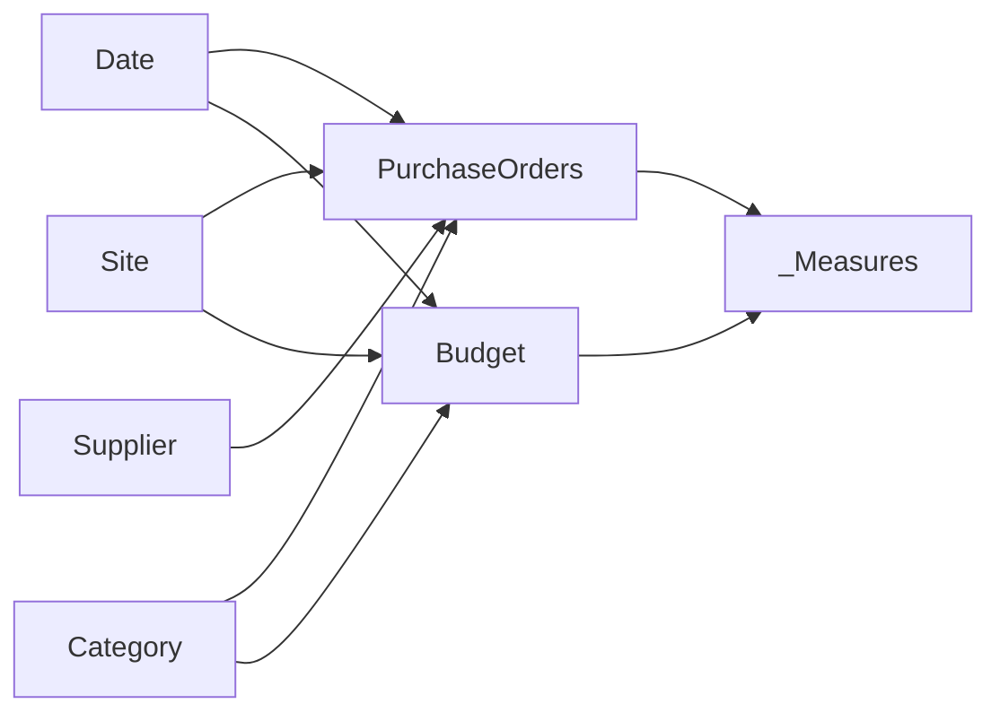

# Procurement & Financial Control Tower — Power BI

[English](#english) · [Français](#francais)

---

# 🇬🇧 English

> **Power BI decision-support project combining procurement activity, budget execution, supplier performance, open commitments and delivery reliability in a single executive control tower.**

## Professional context

This project is an **anonymized portfolio reconstruction inspired by financial steering, procurement analytics and operational reporting work I developed during my professional experience at ENGIE**.

It demonstrates the type of purchasing, supplier, commitment and budget-monitoring logic used in a professional environment while keeping the public portfolio version fully synthetic and independent from production systems.

> This is **not an official ENGIE deliverable**. Company names, suppliers, sites, identifiers, values and datasets have been anonymized, modified or recreated for public presentation. No confidential production information is intentionally published.

## Project

➡️ **[Open the Power BI project](./dashboard/Asterion_Procurement_Control_Tower.pbip)**

## Dashboard preview

Screenshots will be added to [`assets/`](./assets/) after the final capture session.

Planned views:

1. **Executive Overview**
2. **Financial Control**
3. **Procurement Analytics**
4. **Supplier Performance**
5. **Commitments & Exceptions**

---

## Business objective

The goal is to create a single management cockpit capable of answering questions such as:

- How much has been ordered, invoiced and committed?
- Is budget consumption under control by year, site and category?
- Which purchasing categories concentrate the largest spend?
- Which suppliers combine high spend with delivery risk?
- What is the remaining open commitment exposure?
- How many open purchase orders are already late?
- What value is currently overdue?
- Are negotiated savings and purchasing performance improving?
- Is supplier delivery performance meeting the expected OTIF level?

The model is designed to connect **financial steering and procurement execution**, instead of treating them as separate reporting topics.

---

## Dashboard walkthrough

### 1. Executive Overview

Executive cockpit with:

- invoiced spend;
- total budget;
- committed utilisation;
- negotiated savings;
- OTIF;
- monthly spend vs. budget;
- category exposure;
- site financial position;
- supplier snapshot.

### 2. Financial Control

Dedicated budget and financial steering page covering:

- total budget;
- actual/invoiced spend;
- open commitments;
- remaining budget;
- forecast variance;
- monthly actual vs. budget;
- variance by category;
- budget exposure by site;
- detailed site/category financial position.

### 3. Procurement Analytics

Purchasing-performance analysis including:

- PO volume;
- open purchase orders;
- average PO value;
- savings rate;
- active suppliers;
- spend and savings by category;
- PO status mix;
- spend by buyer;
- purchase-order detail.

### 4. Supplier Performance

Supplier-management page combining:

- OTIF;
- average lead time;
- high-risk spend;
- supplier spend vs. OTIF;
- exposure by supplier risk;
- supplier scorecard.

### 5. Commitments & Exceptions

Operational exception cockpit covering:

- open commitments;
- overdue value;
- invoice coverage;
- open PO count;
- late open purchase orders;
- commitment ageing / due buckets;
- PO value by urgency;
- commitment exception detail.

---

## Core KPI logic

| KPI | Business meaning |
|---|---|
| **PO Value** | Total purchase-order value |
| **Invoiced Spend** | Amount invoiced against purchase orders |
| **Open Commitments** | Remaining value only on Open / Partial orders |
| **Committed Utilisation %** | Invoiced spend + open commitments compared with budget |
| **Budget Remaining** | Budget still available after invoiced and committed amounts |
| **Savings** | Difference between baseline value and final PO value |
| **Savings %** | Savings relative to baseline purchasing value |
| **OTIF %** | Share of deliveries completed on time and in full |
| **Late Open POs** | Open / Partial POs past their due date |
| **Overdue Value** | Open commitment value already past due date |
| **Invoice Coverage %** | Invoiced amount compared with PO value |

Closed and cancelled purchase orders are explicitly excluded from remaining open commitments.

---

## Data model

The semantic model uses a star-schema style design around procurement and budget facts.

Main model objects:

- `Date`
- `Site`
- `Category`
- `Supplier`
- `PurchaseOrders`
- `Budget`
- `_Measures`

The public model uses **embedded synthetic data covering 2023–2026**, so no local production Excel/CSV source is required.

---

## Key capabilities demonstrated

| Area | Demonstrated capability |
|---|---|
| **Financial steering** | Budget, actual spend, commitments, remaining budget and forecast analysis |
| **Procurement analytics** | PO activity, category spend, buyers, savings and order status |
| **Supplier management** | OTIF, lead time, risk segmentation and spend concentration |
| **Exception management** | Late orders, overdue exposure and commitment ageing |
| **DAX** | Financial KPIs, time comparison, utilisation ratios and exception logic |
| **Semantic modeling** | Shared dimensions across procurement and budget facts |
| **PBIP / TMDL** | Source-controlled Power BI project structure |
| **UX / reporting** | Executive hierarchy, dark control-tower design and consistent filtering |
| **Data privacy** | Fully synthetic portfolio-safe dataset |

---

## Validation highlights

Power BI Desktop testing was used to correct the final portfolio version.

The validated model includes:

- coherent Year / Site / Category filtering;
- populated Open / Partial commitment cases for every year from 2023 to 2026;
- corrected `Late Open POs`, `Overdue Value`, `Prior Year Spend` and `Spend YoY %` logic;
- zero-safe measures for KPI cards;
- corrected financial display units;
- no external production data source path.

Detailed validation is available in [`docs/VALIDATION.md`](./docs/VALIDATION.md).

---

## Files

- **Power BI project:** `dashboard/Asterion_Procurement_Control_Tower.pbip`
- **PBIR report definition:** `dashboard/Asterion Procurement Control Tower.Report/`
- **TMDL semantic model:** `dashboard/Asterion Procurement Control Tower.SemanticModel/`
- **Browsable model extracts:** `model/`
- **Business logic:** `docs/BUSINESS_LOGIC.md`
- **Validation:** `docs/VALIDATION.md`
- **Dashboard screenshots:** `assets/`
- **Synthetic-data note:** `data/README.md`
- **Integrity checks:** `SHA256SUMS.txt`

## Tech stack

**Power BI Desktop · Power Query / M · DAX · PBIP · PBIR · TMDL**

---

# 🇫🇷 Français

> **Projet Power BI d'aide à la décision réunissant activité achats, exécution budgétaire, performance fournisseurs, engagements ouverts et fiabilité des livraisons dans une seule Control Tower.**

## Contexte professionnel

Ce projet est une **reconstruction portfolio anonymisée inspirée de travaux de pilotage financier, d'analyse achats et de reporting opérationnel réalisés dans le cadre de mon expérience professionnelle chez ENGIE**.

Il présente le type de logique de suivi des commandes, fournisseurs, engagements et budgets utilisé dans un environnement professionnel, tout en reposant ici sur un jeu de données entièrement synthétique et indépendant des systèmes de production.

> Il ne s'agit **pas d'un livrable officiel ENGIE**. Les noms d'entreprises, fournisseurs, sites, identifiants, montants et jeux de données ont été anonymisés, modifiés ou recréés pour une présentation publique. Aucune donnée confidentielle de production n'est volontairement publiée.

## Projet

➡️ **[Ouvrir le projet Power BI](./dashboard/Asterion_Procurement_Control_Tower.pbip)**

## Aperçu du dashboard

Les captures seront ajoutées dans [`assets/`](./assets/) après la session finale de captures.

Vues prévues :

1. **Executive Overview**
2. **Financial Control**
3. **Procurement Analytics**
4. **Supplier Performance**
5. **Commitments & Exceptions**

---

## Objectif métier

L'objectif est de disposer d'un cockpit unique permettant de répondre rapidement aux questions suivantes :

- Quel montant a été commandé, facturé et engagé ?
- La consommation budgétaire est-elle maîtrisée par année, site et catégorie ?
- Quelles familles d'achats concentrent le plus de dépenses ?
- Quels fournisseurs combinent forte dépense et risque de livraison ?
- Quel est le montant des engagements encore ouverts ?
- Combien de commandes ouvertes sont déjà en retard ?
- Quelle valeur est actuellement échue ?
- Les économies négociées progressent-elles ?
- La performance de livraison fournisseurs respecte-t-elle le niveau OTIF attendu ?

Le modèle rapproche **pilotage financier et exécution achats** dans une même lecture décisionnelle.

---

## Présentation des vues

### 1. Executive Overview

Cockpit exécutif avec dépenses facturées, budget, utilisation engagée, économies, OTIF, évolution mensuelle, exposition par catégorie, position financière des sites et synthèse fournisseurs.

### 2. Financial Control

Vue dédiée au pilotage du budget : budget total, dépenses réelles, engagements ouverts, budget restant, forecast, écarts par catégorie et détail site / catégorie.

### 3. Procurement Analytics

Analyse de l'activité achats : volumétrie PO, commandes ouvertes, valeur moyenne, taux d'économies, fournisseurs actifs, catégories, statuts, acheteurs et détail des commandes.

### 4. Supplier Performance

Pilotage fournisseurs : OTIF, lead time moyen, dépenses à risque, comparaison dépenses / OTIF, exposition par niveau de risque et scorecard fournisseurs.

### 5. Commitments & Exceptions

Suivi des exceptions : engagements ouverts, valeur échue, couverture de facturation, commandes ouvertes, commandes en retard, ancienneté des engagements, urgence et détail des exceptions.

---

## Logique KPI principale

| KPI | Définition métier |
|---|---|
| **PO Value** | Valeur totale des commandes |
| **Invoiced Spend** | Montant facturé sur les commandes |
| **Open Commitments** | Valeur restante uniquement sur les commandes Open / Partial |
| **Committed Utilisation %** | Facturé + engagements ouverts comparés au budget |
| **Budget Remaining** | Budget restant après facturation et engagements |
| **Savings** | Écart entre valeur de référence et valeur finale commandée |
| **Savings %** | Économies rapportées à la valeur de référence |
| **OTIF %** | Part des livraisons réalisées à l'heure et complètes |
| **Late Open POs** | Commandes Open / Partial dont l'échéance est dépassée |
| **Overdue Value** | Engagement ouvert correspondant aux commandes déjà échues |
| **Invoice Coverage %** | Montant facturé rapporté à la valeur commandée |

Les commandes clôturées et annulées sont explicitement exclues des engagements ouverts restants.

---

## Modèle de données

Le modèle s'appuie sur une architecture de type étoile autour des faits achats et budget.

Objets principaux :

- `Date`
- `Site`
- `Category`
- `Supplier`
- `PurchaseOrders`
- `Budget`
- `_Measures`

Les données publiques sont **synthétiques et couvrent 2023–2026**. Aucun fichier de production externe n'est nécessaire pour présenter le projet.

---

## Compétences démontrées

| Domaine | Compétence démontrée |
|---|---|
| **Pilotage financier** | Budget, dépenses, engagements, reste à consommer et forecast |
| **Analyse achats** | Commandes, catégories, acheteurs, économies et statuts |
| **Gestion fournisseurs** | OTIF, lead time, risque et concentration des dépenses |
| **Gestion des exceptions** | Retards, exposition échue et ancienneté des engagements |
| **DAX** | KPI financiers, comparaisons temporelles, ratios et logique d'exception |
| **Modélisation** | Dimensions communes aux faits achats et budget |
| **PBIP / TMDL** | Développement Power BI versionnable |
| **UX / Reporting** | Hiérarchie exécutive, design Control Tower et filtres cohérents |
| **Confidentialité** | Données entièrement synthétiques adaptées à un portfolio public |

---

## Validation

La version portfolio finale a été testée dans Power BI Desktop après correction des premières anomalies du projet PBIP.

Les contrôles couvrent notamment :

- filtrage cohérent Année / Site / Catégorie ;
- engagements Open / Partial disponibles sur chaque année 2023–2026 ;
- correction des mesures `Late Open POs`, `Overdue Value`, `Prior Year Spend` et `Spend YoY %` ;
- mesures sécurisées contre les valeurs vides sur les cartes KPI ;
- correction des unités d'affichage financières ;
- absence de chemin de source de données de production externe.

La validation détaillée se trouve dans [`docs/VALIDATION.md`](./docs/VALIDATION.md).

## Fichiers

- **Projet Power BI :** `dashboard/Asterion_Procurement_Control_Tower.pbip`
- **Rapport PBIR :** `dashboard/Asterion Procurement Control Tower.Report/`
- **Modèle TMDL :** `dashboard/Asterion Procurement Control Tower.SemanticModel/`
- **Extraits du modèle :** `model/`
- **Logique métier :** `docs/BUSINESS_LOGIC.md`
- **Validation :** `docs/VALIDATION.md`
- **Captures du dashboard :** `assets/`
- **Note données synthétiques :** `data/README.md`
- **Contrôles d'intégrité :** `SHA256SUMS.txt`

## Stack technique

**Power BI Desktop · Power Query / M · DAX · PBIP · PBIR · TMDL**

## Confidentialité

Ce dépôt est une version portfolio publique. Les organisations, fournisseurs, sites, valeurs financières et données opérationnelles ont été recréés ou anonymisés afin de ne pas publier d'informations confidentielles.
