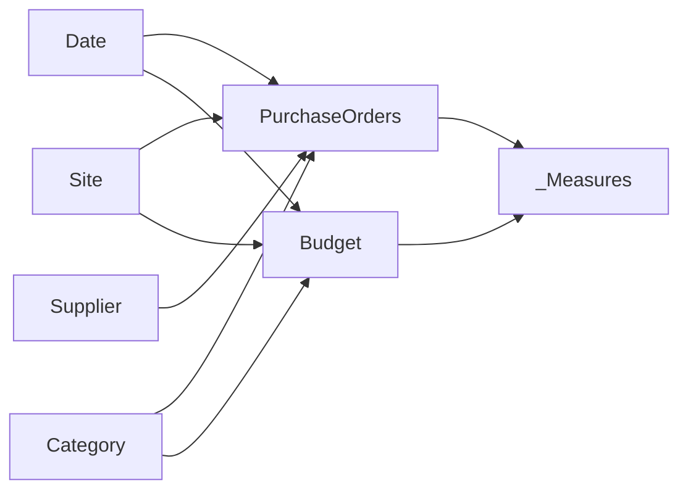

# Power BI — Procurement & Financial Control Tower

[English](#english) · [Français](#francais)

---

# 🇬🇧 English

> **Executive Power BI control tower for procurement performance, budget execution, supplier monitoring, open commitments and operational exceptions.**

## Professional context

This project is an **anonymized portfolio reconstruction inspired by financial steering, procurement analytics and operational reporting work I developed during my professional experience at ENGIE**.

It demonstrates the type of purchasing, supplier, commitment and budget-monitoring logic used in a professional environment while keeping the public portfolio version fully synthetic and independent from production systems.

> This is **not an official ENGIE deliverable**. Company names, suppliers, sites, identifiers, values and datasets have been anonymized, modified or recreated for public presentation. No confidential production information is intentionally published.

## Project

➡️ **[Open the Power BI project](./dashboard/Asterion_Procurement_Control_Tower.pbip)**

## Dashboard preview

The final portfolio screenshots are organized around five management views:

1. **Executive Procurement Control Tower** — consolidated financial, procurement and supplier-performance overview.
2. **Financial Control — Budget, Spend & Commitments** — budget execution, actual spend, commitments and forecast variance.
3. **Procurement Analytics — Orders, Savings & Buyers** — purchasing volumes, category mix, buyers, savings and order status.
4. **Supplier Performance — OTIF, Lead Time & Risk** — supplier reliability, commercial exposure and delivery performance.
5. **Commitments & Exceptions — Overdue Exposure & Open POs** — outstanding commitments, overdue value and operational exceptions.

Final screenshots are stored in [`assets/`](./assets/) once validated for portfolio publication.

---

## Business objective

The goal is to create a single management cockpit capable of answering questions such as:

- How much has been ordered, invoiced and committed?
- Is budget consumption under control by year, site and category?
- Which purchasing categories concentrate the largest spend?
- Which suppliers combine high spend with delivery risk?
- What is the remaining open commitment exposure?
- How many open purchase orders are already late?
- What value is currently overdue?
- Are negotiated savings and purchasing performance improving?
- Is supplier delivery performance meeting the expected OTIF level?

The model is designed to connect **financial steering and procurement execution**, instead of treating them as separate reporting topics.

---

## Dashboard walkthrough

### 1. Executive Procurement Control Tower

**What a recruiter should notice**

- Executive KPI layer combining **Invoiced Spend, Budget, Committed Utilisation, Negotiated Savings and OTIF**
- Monthly spend-versus-budget trajectory
- Spend and open commitments by purchasing category
- Site-level financial positioning
- Supplier snapshot combining spend, commitments, risk and OTIF
- Shared Year / Site / Category filtering for consistent analysis

This page acts as the **management cockpit** of the report. It brings financial, procurement and supplier indicators together so a decision-maker can understand the overall position before moving into specialist analysis.

---

### 2. Financial Control — Budget, Spend & Commitments

**What a recruiter should notice**

- Total budget, actual spend, open commitments and remaining budget
- Forecast variance for forward-looking financial steering
- Monthly actual-versus-budget evolution
- Budget variance analysis by purchasing category
- Site-level exposure comparison
- Detailed Site × Category financial table
- Consistent filter propagation across finance visuals

This view focuses on **budget execution and commitment control**. It helps management understand not only what has already been invoiced, but also what is still financially committed.

---

### 3. Procurement Analytics — Orders, Savings & Buyers

**What a recruiter should notice**

- Purchase-order volume and open-order monitoring
- Average purchase-order value
- Savings rate and negotiated savings logic
- Number of active suppliers
- Spend and savings by category
- Purchase-order status distribution
- Spend analysis by buyer
- Transaction-level purchase-order detail

This page turns purchasing activity into a **procurement-performance view**, connecting operational PO volumes with savings, supplier activity and buyer-level analysis.

---

### 4. Supplier Performance — OTIF, Lead Time & Risk

**What a recruiter should notice**

- OTIF used as a core supplier-delivery KPI
- Average lead-time monitoring
- High-risk supplier spend
- Supplier spend compared with delivery performance
- Exposure segmented by supplier risk level
- Supplier scorecard combining commercial and operational indicators

This page supports **supplier-performance management** by combining spend concentration with delivery reliability and risk instead of evaluating suppliers only on purchasing volume.

---

### 5. Commitments & Exceptions — Overdue Exposure & Open POs

**What a recruiter should notice**

- Open financial commitments
- Overdue commitment value
- Invoice coverage ratio
- Open and late purchase-order monitoring
- Commitment ageing through due-date buckets
- Purchase-order value by urgency
- Detailed exception table for investigation

This page converts outstanding purchasing activity into an **exception-management cockpit**, making it easier to identify overdue exposure and prioritize the purchase orders requiring action.

---

## Core KPI logic

| KPI | Business meaning |
|---|---|
| **PO Value** | Total purchase-order value |
| **Invoiced Spend** | Amount invoiced against purchase orders |
| **Open Commitments** | Remaining value only on Open / Partial orders |
| **Committed Utilisation %** | Invoiced spend + open commitments compared with budget |
| **Budget Remaining** | Budget still available after invoiced and committed amounts |
| **Savings** | Difference between baseline value and final PO value |
| **Savings %** | Savings relative to baseline purchasing value |
| **OTIF %** | Share of deliveries completed on time and in full |
| **Late Open POs** | Open / Partial POs past their due date |
| **Overdue Value** | Open commitment value already past due date |
| **Invoice Coverage %** | Invoiced amount compared with PO value |

Closed and cancelled purchase orders are explicitly excluded from remaining open commitments.

---

## Data model

The semantic model uses a star-schema style design around procurement and budget facts.

Main model objects:

- `Date`
- `Site`
- `Category`
- `Supplier`
- `PurchaseOrders`
- `Budget`
- `_Measures`

The public model uses **deterministic synthetic Power Query data covering 2023–2026**, so no local production Excel/CSV source is required.

---

## Key capabilities demonstrated

| Area | Demonstrated capability |
|---|---|
| **Financial steering** | Budget, actual spend, commitments, remaining budget and forecast analysis |
| **Procurement analytics** | PO activity, category spend, buyers, savings and order status |
| **Supplier management** | OTIF, lead time, risk segmentation and spend concentration |
| **Exception management** | Late orders, overdue exposure and commitment ageing |
| **DAX** | Financial KPIs, time comparison, utilisation ratios and exception logic |
| **Semantic modeling** | Shared dimensions across procurement and budget facts |
| **PBIP / TMDL** | Source-controlled Power BI project structure |
| **UX / reporting** | Executive hierarchy, dark control-tower design and consistent filtering |
| **Data privacy** | Fully synthetic portfolio-safe dataset |

---

## Validation highlights

Power BI Desktop testing was used to correct the final portfolio version.

The validated model includes:

- coherent Year / Site / Category filtering;
- populated Open / Partial commitment cases for every year from 2023 to 2026;
- corrected `Late Open POs`, `Overdue Value`, `Prior Year Spend` and `Spend YoY %` logic;
- zero-safe measures for KPI cards;
- corrected financial display units;
- no external production data source path.

Detailed validation is available in [`docs/VALIDATION.md`](./docs/VALIDATION.md).

---

## Files

- **Power BI project:** `dashboard/Asterion_Procurement_Control_Tower.pbip`
- **PBIR report definition:** `dashboard/Asterion Procurement Control Tower.Report/`
- **TMDL semantic model:** `dashboard/Asterion Procurement Control Tower.SemanticModel/`
- **Browsable model extracts:** `model/`
- **Business logic:** `docs/BUSINESS_LOGIC.md`
- **Validation:** `docs/VALIDATION.md`
- **Dashboard screenshots:** `assets/`
- **Synthetic-data note:** `data/README.md`

## Tech stack

**Power BI Desktop · Power Query / M · DAX · PBIP · PBIR · TMDL**

---

# 🇫🇷 Français

> **Control Tower Power BI de pilotage réunissant performance achats, exécution budgétaire, suivi fournisseurs, engagements ouverts et gestion des exceptions.**

## Contexte professionnel

Ce projet est une **reconstruction portfolio anonymisée inspirée de travaux de pilotage financier, d'analyse achats et de reporting opérationnel réalisés dans le cadre de mon expérience professionnelle chez ENGIE**.

Il présente le type de logique de suivi des commandes, fournisseurs, engagements et budgets utilisé dans un environnement professionnel, tout en reposant ici sur un jeu de données entièrement synthétique et indépendant des systèmes de production.

> Il ne s'agit **pas d'un livrable officiel ENGIE**. Les noms d'entreprises, fournisseurs, sites, identifiants, montants et jeux de données ont été anonymisés, modifiés ou recréés pour une présentation publique. Aucune donnée confidentielle de production n'est volontairement publiée.

## Projet

➡️ **[Ouvrir le projet Power BI](./dashboard/Asterion_Procurement_Control_Tower.pbip)**

## Aperçu du dashboard

La présentation portfolio s'organise autour de cinq vues de pilotage :

1. **Executive Procurement Control Tower** — synthèse financière, achats et performance fournisseurs.
2. **Financial Control — Budget, Spend & Commitments** — budget, dépenses réelles, engagements et forecast.
3. **Procurement Analytics — Orders, Savings & Buyers** — commandes, économies, catégories et acheteurs.
4. **Supplier Performance — OTIF, Lead Time & Risk** — fiabilité fournisseurs, délais et exposition au risque.
5. **Commitments & Exceptions — Overdue Exposure & Open POs** — engagements ouverts, retards et exceptions opérationnelles.

Les captures finales validées pour le portfolio sont stockées dans [`assets/`](./assets/).

---

## Objectif métier

L'objectif est de disposer d'un cockpit unique permettant de répondre rapidement aux questions suivantes :

- Quel montant a été commandé, facturé et engagé ?
- La consommation budgétaire est-elle maîtrisée par année, site et catégorie ?
- Quelles familles d'achats concentrent le plus de dépenses ?
- Quels fournisseurs combinent forte dépense et risque de livraison ?
- Quel est le montant des engagements encore ouverts ?
- Combien de commandes ouvertes sont déjà en retard ?
- Quelle valeur est actuellement échue ?
- Les économies négociées progressent-elles ?
- La performance de livraison fournisseurs respecte-t-elle le niveau OTIF attendu ?

Le modèle rapproche **pilotage financier et exécution achats** dans une même lecture décisionnelle.

---

## Présentation des vues

### 1. Executive Procurement Control Tower

**Ce qu'un recruteur peut identifier immédiatement**

- Couche KPI exécutive : **dépenses facturées, budget, utilisation engagée, économies négociées et OTIF**
- Évolution mensuelle dépenses vs budget
- Répartition dépenses / engagements par catégorie
- Position financière par site
- Synthèse fournisseurs avec dépenses, engagements, risque et OTIF
- Filtres communs Année / Site / Catégorie

Cette page joue le rôle de **cockpit de management**. Elle rassemble finance, achats et fournisseurs dans une lecture unique avant de passer aux analyses spécialisées.

---

### 2. Financial Control — Budget, Spend & Commitments

**Ce qu'un recruteur peut identifier immédiatement**

- Budget total, dépenses réelles, engagements ouverts et budget restant
- Écart au forecast pour anticiper la trajectoire financière
- Évolution mensuelle réel vs budget
- Analyse des écarts par catégorie d'achats
- Comparaison de l'exposition financière entre sites
- Tableau détaillé Site × Catégorie
- Propagation cohérente des filtres sur les indicateurs financiers

Cette vue est dédiée au **pilotage budgétaire et au contrôle des engagements**. Elle permet de distinguer ce qui est déjà facturé de ce qui reste financièrement engagé.

---

### 3. Procurement Analytics — Orders, Savings & Buyers

**Ce qu'un recruteur peut identifier immédiatement**

- Volumétrie des commandes et suivi des PO ouverts
- Valeur moyenne des commandes
- Taux et montant des économies négociées
- Nombre de fournisseurs actifs
- Dépenses et économies par catégorie
- Répartition des statuts de commandes
- Analyse des dépenses par acheteur
- Détail transactionnel des commandes

Cette page transforme l'activité achats en une **lecture de performance procurement**, en reliant volumes de commandes, économies, fournisseurs et activité des acheteurs.

---

### 4. Supplier Performance — OTIF, Lead Time & Risk

**Ce qu'un recruteur peut identifier immédiatement**

- OTIF comme KPI principal de fiabilité fournisseur
- Suivi du lead time moyen
- Dépenses exposées aux fournisseurs à risque
- Comparaison dépenses / performance de livraison
- Exposition par niveau de risque fournisseur
- Scorecard regroupant indicateurs commerciaux et opérationnels

Cette vue permet de piloter la **performance fournisseurs** en croisant concentration des dépenses, qualité de livraison et niveau de risque.

---

### 5. Commitments & Exceptions — Overdue Exposure & Open POs

**Ce qu'un recruteur peut identifier immédiatement**

- Engagements financiers encore ouverts
- Valeur des engagements échus
- Taux de couverture de facturation
- Commandes ouvertes et commandes en retard
- Ancienneté des engagements par tranche d'échéance
- Valeur des commandes par niveau d'urgence
- Tableau détaillé des exceptions à traiter

Cette page transforme les engagements non soldés en **cockpit de gestion des exceptions**, afin d'identifier rapidement les commandes nécessitant une action.

---

## Logique KPI principale

| KPI | Définition métier |
|---|---|
| **PO Value** | Valeur totale des commandes |
| **Invoiced Spend** | Montant facturé sur les commandes |
| **Open Commitments** | Valeur restante uniquement sur les commandes Open / Partial |
| **Committed Utilisation %** | Facturé + engagements ouverts comparés au budget |
| **Budget Remaining** | Budget restant après facturation et engagements |
| **Savings** | Écart entre valeur de référence et valeur finale commandée |
| **Savings %** | Économies rapportées à la valeur de référence |
| **OTIF %** | Part des livraisons réalisées à l'heure et complètes |
| **Late Open POs** | Commandes Open / Partial dont l'échéance est dépassée |
| **Overdue Value** | Engagement ouvert correspondant aux commandes déjà échues |
| **Invoice Coverage %** | Montant facturé rapporté à la valeur commandée |

Les commandes clôturées et annulées sont explicitement exclues des engagements ouverts restants.

---

## Modèle de données

Le modèle s'appuie sur une architecture de type étoile autour des faits achats et budget.

Objets principaux :

- `Date`
- `Site`
- `Category`
- `Supplier`
- `PurchaseOrders`
- `Budget`
- `_Measures`

Les données publiques sont **synthétiques, générées de façon déterministe dans Power Query et couvrent 2023–2026**. Aucun fichier de production externe n'est nécessaire pour présenter le projet.

---

## Compétences démontrées

| Domaine | Compétence démontrée |
|---|---|
| **Pilotage financier** | Budget, dépenses, engagements, reste à consommer et forecast |
| **Analyse achats** | Commandes, catégories, acheteurs, économies et statuts |
| **Gestion fournisseurs** | OTIF, lead time, risque et concentration des dépenses |
| **Gestion des exceptions** | Retards, exposition échue et ancienneté des engagements |
| **DAX** | KPI financiers, comparaisons temporelles, ratios et logique d'exception |
| **Modélisation** | Dimensions communes aux faits achats et budget |
| **PBIP / TMDL** | Développement Power BI versionnable |
| **UX / Reporting** | Hiérarchie exécutive, design Control Tower et filtres cohérents |
| **Confidentialité** | Données entièrement synthétiques adaptées à un portfolio public |

---

## Validation

La version portfolio finale a été testée dans Power BI Desktop après correction des premières anomalies du projet PBIP.

Les contrôles couvrent notamment :

- filtrage cohérent Année / Site / Catégorie ;
- engagements Open / Partial disponibles sur chaque année 2023–2026 ;
- correction des mesures `Late Open POs`, `Overdue Value`, `Prior Year Spend` et `Spend YoY %` ;
- mesures sécurisées contre les valeurs vides sur les cartes KPI ;
- correction des unités d'affichage financières ;
- absence de chemin de source de données de production externe.

La validation détaillée se trouve dans [`docs/VALIDATION.md`](./docs/VALIDATION.md).

## Fichiers

- **Projet Power BI :** `dashboard/Asterion_Procurement_Control_Tower.pbip`
- **Rapport PBIR :** `dashboard/Asterion Procurement Control Tower.Report/`
- **Modèle TMDL :** `dashboard/Asterion Procurement Control Tower.SemanticModel/`
- **Extraits du modèle :** `model/`
- **Logique métier :** `docs/BUSINESS_LOGIC.md`
- **Validation :** `docs/VALIDATION.md`
- **Captures du dashboard :** `assets/`
- **Note données synthétiques :** `data/README.md`

## Stack technique

**Power BI Desktop · Power Query / M · DAX · PBIP · PBIR · TMDL**

## Confidentialité

Ce dépôt est une version portfolio publique. Les organisations, fournisseurs, sites, valeurs financières et données opérationnelles ont été recréés ou anonymisés afin de ne pas publier d'informations confidentielles.
