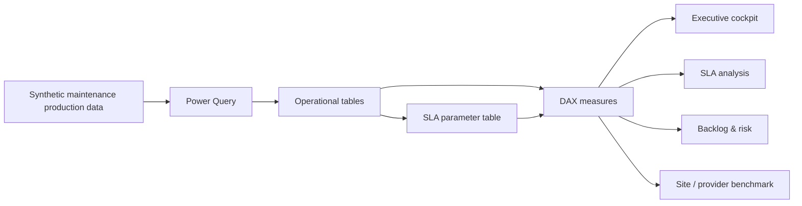
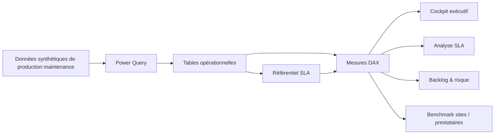

# Power BI — SLA & Penalties Operations Portfolio

[English](#english) · [Français](#francais)

---

<a id="english"></a>

# 🇬🇧 English

> **Operational Power BI dashboard for SLA compliance, intervention delays, restoration / resolution performance, backlog and contractual penalty exposure.**


## Professional context

This project is an **anonymized and synthetic portfolio reconstruction inspired by operational performance and SLA-monitoring work I carried out during my professional experience at ENGIE**.

It demonstrates the type of service-performance, backlog, contractual-risk and multi-site operational analysis I worked on in a professional environment.

> This is **not an official ENGIE deliverable**. The data, organizations, thresholds, contractual assumptions and operational identifiers are synthetic, anonymized or recreated for public demonstration.

## Project objective

This project simulates the monitoring of a large multi-site maintenance operation. It focuses on **service-level agreements (SLA)** and the operational / financial consequences of missed commitments.

The report separates:

- historical performance from open backlog;
- intervention response time from restoration / resolution time;
- compliant, late and non-evaluable work orders;
- raw contractual exposure from cases requiring investigation;
- operational causes such as suspension, quotation workflow or parts waiting.

The dataset is fully synthetic and designed for portfolio demonstration.

## Main dashboard areas

| Area | Purpose |
|---|---|
| **Executive cockpit** | Overall production, SLA health, risk and backlog |
| **SLA health** | Intervention, restoration / resolution and acknowledgement compliance |
| **Contractual risk** | Potential penalties and files requiring review |
| **Intervention performance** | Distribution, P95, median, average and SLA overruns |
| **Restoration / resolution performance** | Distribution, P95 and long-tail analysis |
| **Benchmark** | Compare sites and service providers |
| **Workload** | Volume, seasonality and criticality mix |
| **Backlog** | Open work orders and overdue items |
| **Preventive maintenance** | Compliance and workload |
| **Technician analysis** | Workload, efficiency and quality |

The Power BI report contains **11 main business pages** plus drill-through, detailed analysis and tooltip pages.

## SLA logic

A central parameter table is used to avoid scattering business thresholds across measures.

| Criticality | Intervention SLA | Restoration SLA | Acknowledgement SLA | Potential intervention penalty |
|---|---:|---:|---:|---:|
| **C1** | 30 min | 2 business days | 60 min | €1,500 |
| **VIP** | 30 min | 2 business days | 30 min | €1,500 |
| **C2** | 120 min | 8 business days | 120 min | €500 |

> These thresholds are fictitious portfolio assumptions, not contractual values from a real organization.

## Core business rules

- A work order that has **not started** is excluded from historical intervention-performance statistics and remains in backlog / open risk.
- A work order that is **not resolved** is excluded from historical restoration-performance statistics.
- Cancelled work orders are excluded from operational SLA populations.
- Average, median, P95 and compliance use homogeneous evaluable populations.
- Cases involving suspension, quotation workflow or parts waiting are classified **for investigation** instead of being automatically considered chargeable.
- Benchmark gauges use a real compliance percentage, with a 100% maximum and a 95% target.

## Data flow



## Selected source files

The repository exposes the most relevant PBIP / semantic-model files for code review:

```text
powerbi-sla-penalties-portfolio/
├── dashboard/
│   └── Portfolio_Penalites.pbip
├── model/
│   ├── model.tmdl
│   └── Parametres_SLA.tmdl
├── docs/
│   ├── SLA_LOGIC.md
│   └── VALIDATION.md
└── README.md
```

The complete working report was built in Power BI Desktop using PBIP format. The public repository focuses on the portfolio presentation and the most relevant model logic.

## What this project demonstrates

- Advanced DAX KPI design
- SLA population design and denominator control
- P95 / median / average analysis
- Backlog and open-risk separation
- Contractual penalty exposure
- Multi-site and provider benchmarking
- Drill-through / tooltip design
- Power Query transformation
- PBIP / TMDL source-controlled Power BI development
- Business-oriented data storytelling

## Static validation

Before packaging, the project was statically checked:

- 553 / 553 JSON files valid
- 37 report pages
- 11 visible business pages
- 26 hidden / tooltip / drill-through pages
- 500 visuals
- 0 report references to missing fields or measures
- 0 orphan bookmarks
- 0 missing declared image resources
- 0 external web sources
- 0 user-specific local paths
- 0 targeted sensitive organization references

The remaining dynamic validation step is opening and refreshing the report in Power BI Desktop.

---

<a id="francais"></a>

# 🇫🇷 Français

> **Tableau de bord Power BI opérationnel dédié au respect des SLA, aux délais d'intervention, à la remise en état, au backlog et à l'exposition aux pénalités contractuelles.**

## Contexte professionnel

Ce projet est une **reconstruction portfolio anonymisée et synthétique inspirée de travaux de pilotage opérationnel et de suivi des SLA réalisés dans le cadre de mon expérience professionnelle chez ENGIE**.

Il illustre les problématiques de performance de service, backlog, risque contractuel et pilotage multi-sites sur lesquelles j'ai travaillé en environnement professionnel.

> Il ne s'agit **pas d'un livrable officiel ENGIE**. Les données, organisations, seuils, hypothèses contractuelles et identifiants opérationnels sont synthétiques, anonymisés ou recréés pour une présentation publique.

## Objectif du projet

Ce projet simule le pilotage d'une **exploitation de maintenance multi-sites à forte volumétrie**. Il est centré sur la lecture des engagements de service et sur les conséquences opérationnelles et financières des dépassements.

Le rapport distingue notamment :

- la performance historique du backlog encore ouvert ;
- le délai d'intervention du délai de remise en état / résolution ;
- les DI conformes, hors SLA et non évaluables ;
- l'exposition contractuelle brute des dossiers nécessitant une instruction ;
- les causes opérationnelles : suspension, devis, attente de pièces, etc.

Toutes les données sont **synthétiques et anonymisées** pour un usage portfolio public.

## Principales vues métier

| Vue | Utilité |
|---|---|
| **Cockpit exécutif** | Production, santé SLA, risque et backlog |
| **Santé SLA** | Intervention, RED / résolution et acquittement |
| **Risque contractuel** | Pénalités potentielles et dossiers à instruire |
| **Performance intervention** | Distribution, P95, médiane, moyenne et dépassements |
| **Performance RED** | Distribution, P95 et analyse des dérives |
| **Benchmark** | Comparaison sites et prestataires |
| **Charge DI** | Volumétrie, saisonnalité et criticité |
| **Backlog** | DI ouvertes et hors SLA |
| **Préventif** | Conformité et charge |
| **Intervenants** | Charge, efficacité et qualité |

Le rapport contient **11 pages métier principales** complétées par des pages détaillées, drill-through et info-bulles.

## Référentiel SLA

Les seuils métier sont centralisés dans une table dédiée afin d'éviter de disperser des valeurs en dur dans les mesures.

| Criticité | SLA intervention | SLA remise en état | SLA acquittement | Pénalité INT potentielle |
|---|---:|---:|---:|---:|
| **C1** | 30 min | 2 jours ouvrés | 60 min | 1 500 € |
| **VIP** | 30 min | 2 jours ouvrés | 30 min | 1 500 € |
| **C2** | 120 min | 8 jours ouvrés | 120 min | 500 € |

> Les seuils et montants sont des hypothèses fictives de portfolio et ne correspondent pas à un contrat réel.

## Logique métier principale

- Une DI **non démarrée** n'entre pas dans la performance historique d'intervention : elle reste dans le backlog / risque ouvert.
- Une DI **non résolue** n'entre pas dans la performance historique RED.
- Les annulations sont exclues des populations SLA.
- Moyenne, médiane, P95 et conformité utilisent des populations évaluables homogènes.
- Les dossiers avec suspension, devis ou attente de pièces sont classés **à instruire**, et non automatiquement comme pénalisables.
- Les jauges de benchmark utilisent un véritable taux de conformité, avec maximum 100 % et cible 95 %.

## Flux de données



## Compétences démontrées

- Conception avancée de KPI DAX
- Construction correcte des populations SLA et des dénominateurs
- Analyse moyenne / médiane / P95
- Séparation performance historique / backlog ouvert
- Analyse de l'exposition aux pénalités
- Benchmark multi-sites et prestataires
- Drill-through et info-bulles
- Transformation Power Query
- Développement Power BI versionnable via PBIP / TMDL
- Data storytelling orienté métier

## Validation statique

Avant packaging :

- 553 / 553 JSON valides
- 37 pages
- 11 pages métier visibles
- 26 pages cachées / info-bulles / drill-through
- 500 visuels
- 0 champ ou mesure manquant référencé par le rapport
- 0 bookmark orphelin
- 0 ressource graphique déclarée manquante
- 0 source web externe
- 0 chemin utilisateur spécifique
- 0 référence sensible ciblée restante

La dernière validation dynamique reste l'ouverture et l'actualisation dans Power BI Desktop.
