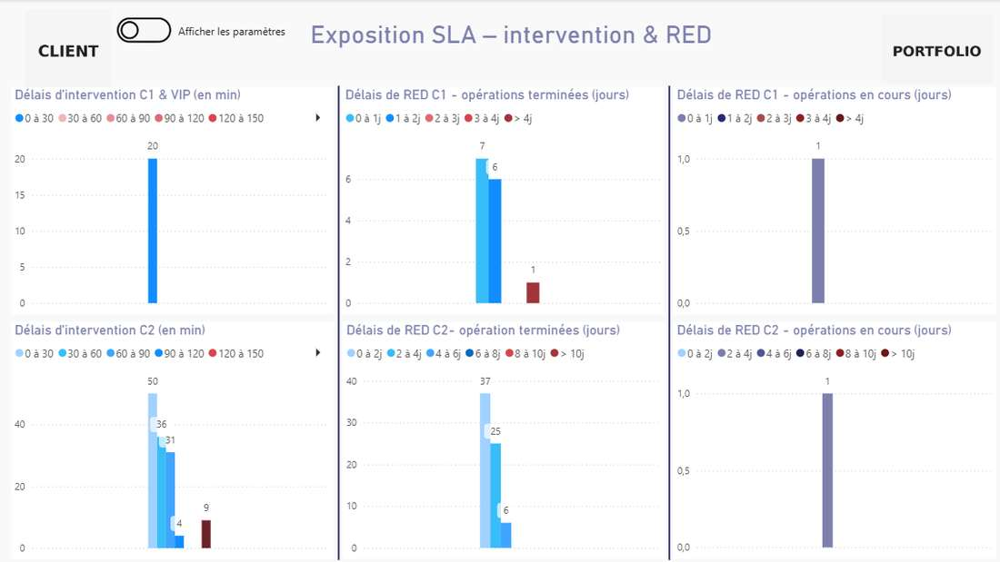
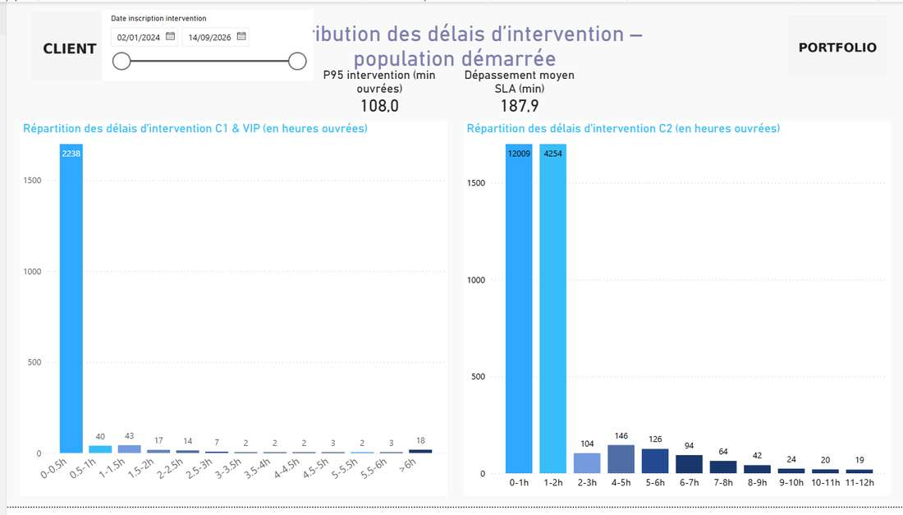
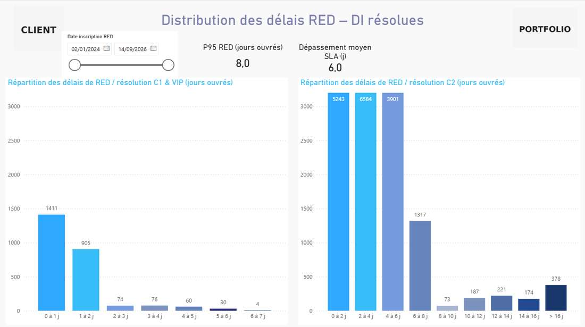
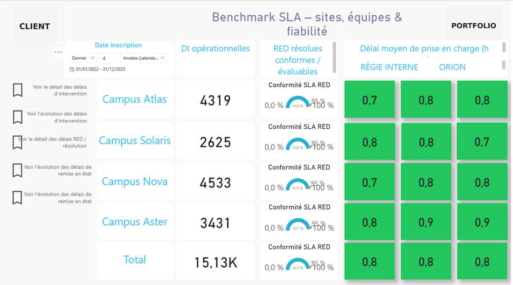
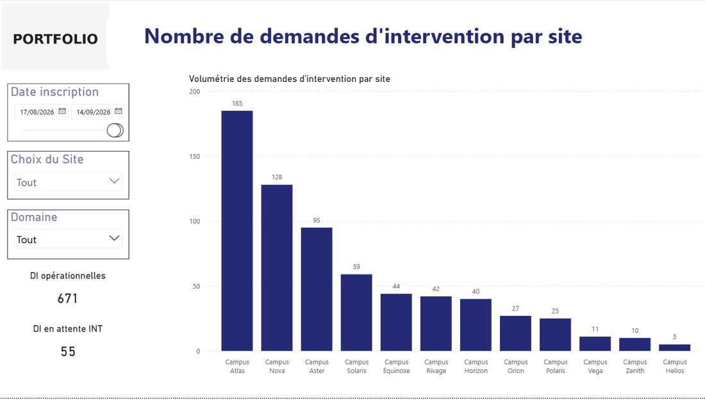
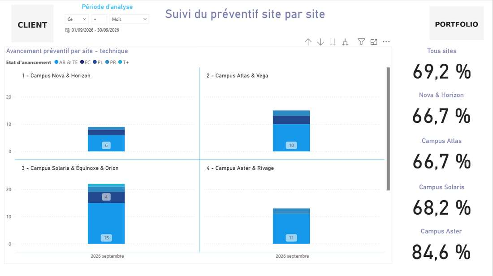
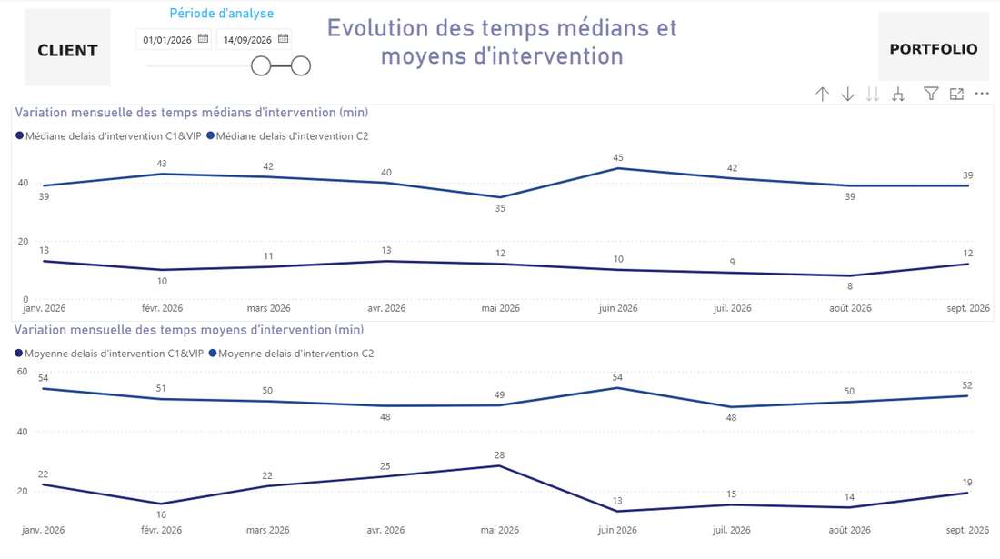
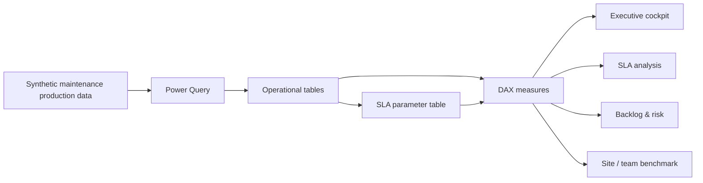
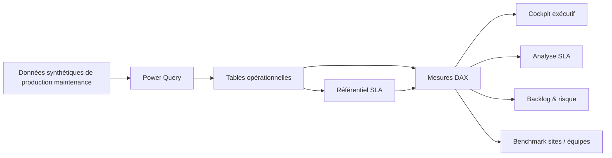

# Power BI — SLA & Penalties Operations Portfolio

[English](#english) · [Français](#francais)

---

# 🇬🇧 English

> **Operational Power BI dashboard for SLA compliance, intervention delays, restoration / resolution performance, backlog and contractual penalty exposure.**

## Professional context

This project is an **anonymized portfolio reconstruction based on operational monitoring and SLA-analysis work carried out during my professional experience at ENGIE**.

It reflects the type of multi-site maintenance reporting, service-performance monitoring, backlog analysis and contractual-risk dashboards I worked on in a professional environment.

The objective of this public version is to demonstrate the analytical logic, Power BI modeling approach and reporting design while protecting confidential information.

> This is **not an official ENGIE deliverable**. All organizations, sites, operational identifiers, datasets, contractual thresholds and financial assumptions shown here have been anonymized, modified or recreated for public presentation.

## Project

➡️ **[Open the Power BI project](./dashboard/Portfolio_Penalites.pbip)**

## Dashboard preview

  

> **Main view:** operational SLA performance with intervention and restoration compliance, P95, backlog indicators and risk-oriented reading.

---

## Business objective

The goal of this project is to turn high-volume maintenance data into a decision-support tool for operational managers.

The dashboard helps answer questions such as:

- Are intervention and restoration commitments being met?
- Which criticality levels are generating the most SLA failures?
- Which sites or service teams are underperforming?
- How large is the current open backlog?
- Which late work orders may create contractual exposure?
- Are the delays isolated events or part of a recurring trend?
- Is preventive maintenance being delivered consistently across sites?
- How do average, median and P95 performance evolve over time?

---

## Dashboard walkthrough

### 1. SLA performance — intervention & restoration

**What a recruiter should notice**

- Clear separation between intervention SLA and restoration / resolution SLA
- Compliance indicators by criticality
- P95 used alongside average and median to avoid hiding long-tail delays
- Historical performance separated from work orders that are still open
- KPI hierarchy designed for rapid management reading

This page provides an executive view of service performance while preserving enough detail to identify where the risk is coming from.

---

### 2. Contractual exposure — intervention & restoration

**What a recruiter should notice**

- Identification of work orders outside SLA
- Potential financial exposure by criticality
- Separation between raw delay and cases requiring investigation
- Operational exceptions such as suspension, quotation workflow or parts waiting
- Risk-oriented dashboard design rather than simple compliance counting

This page demonstrates the ability to move from operational performance to **contractual and financial impact**.

---

### 3. Intervention delay distribution

**What a recruiter should notice**

- Distribution analysis rather than relying only on averages
- Clear visibility of extreme intervention delays
- Segmentation by criticality
- Consistent SLA thresholds
- Ability to identify whether poor performance comes from a broad shift or a small number of outliers

This view is designed to make the statistical shape of intervention performance understandable to both technical and non-technical users.

---

### 4. Restoration / resolution delay distribution

**What a recruiter should notice**

- Dedicated analysis of restoration / resolution lead time
- Long-tail performance visibility
- Criticality-based comparison
- Separation of completed work from open backlog
- Consistent median / average / P95 logic

This page is useful for understanding whether delayed restoration is systemic or concentrated on a limited number of difficult cases.

---

### 5. SLA benchmark — sites & teams

**What a recruiter should notice**

- Comparison of sites using a consistent compliance-rate definition
- Comparison of operational teams / service providers
- 95% management target
- 100% maximum gauge logic
- Fast identification of underperforming areas

This benchmark turns SLA monitoring into an actionable management tool by showing where performance gaps are located.

---

### 6. Work-order volume by site

**What a recruiter should notice**

- Multi-site workload analysis
- Volume split by criticality
- Identification of the busiest sites
- Ability to distinguish high workload from poor performance
- Operational context for interpreting SLA results

A high number of SLA failures does not necessarily mean poor performance if one site is handling substantially more work. This page provides the workload context needed for fair comparison.

---

### 7. Preventive maintenance by site

**What a recruiter should notice**

- Preventive-maintenance completion monitoring
- Site-by-site workload and compliance view
- Detection of execution gaps
- Complementary reading between reactive maintenance and preventive activity
- Operational follow-up beyond penalty-only reporting

This page extends the report from SLA monitoring into broader maintenance-management performance.

---

### 8. Intervention-time trend

**What a recruiter should notice**

- Time-series monitoring of operational performance
- Median and average tracked together
- Trend detection instead of one-period snapshots
- Ability to identify deterioration or improvement over time
- Management-friendly reading of technical service data

This view helps determine whether performance problems are temporary events or a sustained operational trend.

---

## Main dashboard areas

| Area | Purpose |
|---|---|
| **Executive cockpit** | Overall production, SLA health, risk and backlog |
| **SLA health** | Intervention, restoration / resolution and acknowledgement compliance |
| **Contractual risk** | Potential penalties and files requiring review |
| **Intervention performance** | Distribution, P95, median, average and SLA overruns |
| **Restoration / resolution performance** | Distribution, P95 and long-tail analysis |
| **Benchmark** | Compare sites and service teams |
| **Workload** | Volume, seasonality and criticality mix |
| **Backlog** | Open work orders and overdue items |
| **Preventive maintenance** | Compliance and workload |
| **Technician analysis** | Workload, efficiency and quality |

The Power BI report contains **11 main business pages** plus detailed analysis, drill-through and tooltip pages.

---

## SLA logic

A central parameter table is used so that business thresholds are not scattered across multiple measures.

| Criticality | Intervention SLA | Restoration SLA | Acknowledgement SLA | Potential intervention penalty |
|---|---:|---:|---:|---:|
| **C1** | 30 min | 2 business days | 60 min | €1,500 |
| **VIP** | 30 min | 2 business days | 30 min | €1,500 |
| **C2** | 120 min | 8 business days | 120 min | €500 |

> These thresholds are fictitious portfolio assumptions and do not represent confidential ENGIE contractual values.

## Core business rules

- A work order that has **not started** is excluded from historical intervention-performance statistics and remains in backlog / open risk.
- A work order that is **not resolved** is excluded from historical restoration-performance statistics.
- Cancelled work orders are excluded from operational SLA populations.
- Average, median, P95 and compliance use consistent evaluable populations.
- Cases involving suspension, quotation workflow or parts waiting are classified **for investigation** instead of being automatically considered chargeable.
- Benchmark gauges use a real compliance percentage, with a 100% maximum and a 95% target.

## Data flow

## Key capabilities demonstrated

| Area | Demonstrated capability |
|---|---|
| **Data preparation** | Transforming and structuring maintenance data with Power Query |
| **Data modeling** | Building an operational model for SLA, site, criticality and time analysis |
| **DAX** | Compliance rates, P95, median, averages, open-risk and exposure calculations |
| **Operational analytics** | Intervention, restoration, backlog and preventive-maintenance monitoring |
| **Contractual analysis** | Potential penalty exposure and investigation cases |
| **Benchmarking** | Site and service-team comparison using consistent KPI populations |
| **UX / reporting** | Executive KPIs, detailed analysis, drill-through and tooltips |
| **PBIP / TMDL** | Source-controlled Power BI development |
| **Data privacy** | Synthetic and anonymized portfolio-safe data |

## Files

- **Power BI project:** `dashboard/Portfolio_Penalites.pbip`
- **Semantic model:** `model/`
- **Business logic documentation:** `docs/SLA_LOGIC.md`
- **Validation:** `docs/VALIDATION.md`
- **Dashboard screenshots:** `assets/`
- **Integrity checks:** `SHA256SUMS.txt`

## Tech stack

**Power BI Desktop · Power Query · DAX · PBIP · TMDL · Microsoft Excel**

---

# 🇫🇷 Français

> **Tableau de bord Power BI opérationnel dédié au respect des SLA, aux délais d'intervention, à la remise en état, au backlog et à l'exposition aux pénalités contractuelles.**

## Contexte professionnel

Ce projet est une **reconstruction portfolio anonymisée basée sur des travaux de pilotage opérationnel et d'analyse des SLA réalisés dans le cadre de mon expérience professionnelle chez ENGIE**.

Il reflète le type de reporting multi-sites, de suivi de performance de service, d'analyse du backlog et de risque contractuel sur lequel j'ai travaillé en environnement professionnel.

L'objectif de cette version publique est de présenter la logique analytique, la modélisation Power BI et l'approche de reporting tout en protégeant les informations confidentielles.

> Il ne s'agit **pas d'un livrable officiel ENGIE**. Les organisations, sites, identifiants opérationnels, jeux de données, seuils contractuels et hypothèses financières ont été anonymisés, modifiés ou recréés pour une présentation publique.

## Projet

➡️ **[Ouvrir le projet Power BI](./dashboard/Portfolio_Penalites.pbip)**

## Aperçu du dashboard

  

> **Vue principale :** performance opérationnelle des SLA avec conformité intervention / remise en état, P95, backlog et lecture orientée risque.

---

## Objectif métier

L'objectif est de transformer une volumétrie importante de données de maintenance en un véritable outil d'aide à la décision pour l'exploitation.

Le rapport permet notamment de répondre rapidement aux questions suivantes :

- Les engagements d'intervention et de remise en état sont-ils respectés ?
- Quelles criticités génèrent le plus de dépassements SLA ?
- Quels sites ou équipes opérationnelles sous-performent ?
- Quelle est la taille du backlog encore ouvert ?
- Quelles DI hors délai peuvent créer une exposition contractuelle ?
- Les retards sont-ils ponctuels ou récurrents ?
- Le préventif est-il correctement réalisé sur l'ensemble des sites ?
- Comment évoluent la moyenne, la médiane et le P95 dans le temps ?

---

## Présentation des principales vues

### 1. Performance SLA — intervention & remise en état

**Ce qu'un recruteur peut identifier immédiatement**

- Séparation claire entre SLA d'intervention et SLA de remise en état / résolution
- Taux de conformité par criticité
- Utilisation du P95 en complément de la moyenne et de la médiane
- Séparation entre performance historique et DI encore ouvertes
- Hiérarchie KPI conçue pour une lecture rapide par le management

Cette page apporte une vision exécutive de la performance tout en permettant d'identifier immédiatement l'origine du risque.

---

### 2. Exposition contractuelle — intervention & remise en état

**Ce qu'un recruteur peut identifier immédiatement**

- Identification des DI hors SLA
- Estimation de l'exposition financière potentielle
- Séparation entre simple dépassement et dossier nécessitant une instruction
- Prise en compte des suspensions, devis et attentes de pièces
- Lecture orientée risque plutôt qu'un simple comptage des non-conformités

Cette page montre la capacité à transformer une donnée opérationnelle en **lecture contractuelle et financière**.

---

### 3. Distribution des délais d'intervention

**Ce qu'un recruteur peut identifier immédiatement**

- Analyse de distribution plutôt qu'une simple moyenne
- Visibilité des délais extrêmes
- Lecture par criticité
- Seuils SLA cohérents
- Distinction entre dérive générale et quelques valeurs atypiques

Cette vue rend une donnée technique complexe compréhensible rapidement pour un utilisateur métier.

---

### 4. Distribution des délais RED / résolution

**Ce qu'un recruteur peut identifier immédiatement**

- Analyse spécifique du délai de remise en état
- Mise en évidence de la longue traîne
- Comparaison par criticité
- Exclusion du backlog non résolu de la performance historique
- Cohérence moyenne / médiane / P95

Cette page permet d'identifier si les problèmes de remise en état sont structurels ou concentrés sur quelques dossiers complexes.

---

### 5. Benchmark SLA — sites & équipes

**Ce qu'un recruteur peut identifier immédiatement**

- Comparaison homogène des sites
- Benchmark des équipes opérationnelles / prestataires
- Cible de pilotage à 95 %
- Jauges basées sur un véritable taux de conformité
- Identification rapide des périmètres à risque

Cette vue transforme le suivi SLA en outil de management permettant de localiser les écarts de performance.

---

### 6. Volumétrie des DI par site

**Ce qu'un recruteur peut identifier immédiatement**

- Charge de travail multi-sites
- Répartition par criticité
- Identification des sites les plus sollicités
- Mise en contexte des performances SLA
- Distinction entre forte volumétrie et mauvaise performance

Cette page évite d'interpréter un nombre élevé d'incidents sans tenir compte du niveau réel d'activité.

---

### 7. Suivi du préventif par site

**Ce qu'un recruteur peut identifier immédiatement**

- Suivi de réalisation du préventif
- Comparaison site par site
- Identification des écarts d'exécution
- Lecture complémentaire entre maintenance corrective et préventive
- Pilotage opérationnel au-delà des seules pénalités

Cette page élargit le rapport à une vision plus complète de la performance maintenance.

---

### 8. Évolution des temps d'intervention

**Ce qu'un recruteur peut identifier immédiatement**

- Suivi temporel de la performance
- Moyenne et médiane analysées ensemble
- Détection des tendances
- Identification d'une amélioration ou dégradation dans le temps
- Data storytelling adapté à des données techniques

Cette vue permet de distinguer un incident ponctuel d'une dérive durable de la performance.

---

## Principales vues métier

| Vue | Utilité |
|---|---|
| **Cockpit exécutif** | Production, santé SLA, risque et backlog |
| **Santé SLA** | Intervention, RED / résolution et acquittement |
| **Risque contractuel** | Pénalités potentielles et dossiers à instruire |
| **Performance intervention** | Distribution, P95, médiane, moyenne et dépassements |
| **Performance RED** | Distribution, P95 et analyse des dérives |
| **Benchmark** | Comparaison sites et équipes |
| **Charge DI** | Volumétrie, saisonnalité et criticité |
| **Backlog** | DI ouvertes et hors SLA |
| **Préventif** | Conformité et charge |
| **Intervenants** | Charge, efficacité et qualité |

Le rapport contient **11 pages métier principales** complétées par des pages détaillées, drill-through et info-bulles.

---

## Référentiel SLA

Les seuils métier sont centralisés dans une table dédiée afin d'éviter de disperser des valeurs en dur dans les mesures.

| Criticité | SLA intervention | SLA remise en état | SLA acquittement | Pénalité INT potentielle |
|---|---:|---:|---:|---:|
| **C1** | 30 min | 2 jours ouvrés | 60 min | 1 500 € |
| **VIP** | 30 min | 2 jours ouvrés | 30 min | 1 500 € |
| **C2** | 120 min | 8 jours ouvrés | 120 min | 500 € |

> Les seuils et montants sont des hypothèses fictives de portfolio et ne correspondent pas à des valeurs contractuelles confidentielles ENGIE.

## Logique métier principale

- Une DI **non démarrée** n'entre pas dans la performance historique d'intervention : elle reste dans le backlog / risque ouvert.
- Une DI **non résolue** n'entre pas dans la performance historique RED.
- Les annulations sont exclues des populations SLA.
- Moyenne, médiane, P95 et conformité utilisent des populations évaluables cohérentes.
- Les dossiers avec suspension, devis ou attente de pièces sont classés **à instruire**, et non automatiquement comme pénalisables.
- Les jauges de benchmark utilisent un véritable taux de conformité, avec maximum 100 % et cible 95 %.

## Flux de données

## Compétences démontrées

| Domaine | Compétence démontrée |
|---|---|
| **Préparation des données** | Transformation et structuration avec Power Query |
| **Modélisation** | Modèle opérationnel pour SLA, sites, criticités et temps |
| **DAX** | Taux de conformité, P95, médiane, moyenne, risque ouvert et exposition |
| **Analyse opérationnelle** | Intervention, RED, backlog et préventif |
| **Analyse contractuelle** | Exposition potentielle aux pénalités et dossiers à instruire |
| **Benchmark** | Comparaison sites et équipes avec populations KPI homogènes |
| **UX / Reporting** | KPI exécutifs, analyses détaillées, drill-through et info-bulles |
| **PBIP / TMDL** | Développement Power BI versionnable |
| **Confidentialité** | Données synthétiques et anonymisées adaptées à un portfolio public |

## Fichiers

- **Projet Power BI :** `dashboard/Portfolio_Penalites.pbip`
- **Modèle sémantique :** `model/`
- **Documentation métier :** `docs/SLA_LOGIC.md`
- **Validation :** `docs/VALIDATION.md`
- **Captures du dashboard :** `assets/`
- **Contrôles d'intégrité :** `SHA256SUMS.txt`

## Stack technique

**Power BI Desktop · Power Query · DAX · PBIP · TMDL · Microsoft Excel**

## Confidentialité

Ce dépôt est une version portfolio publique. Toutes les données, noms de sites, organisations et hypothèses contractuelles ont été anonymisés, modifiés ou recréés.
